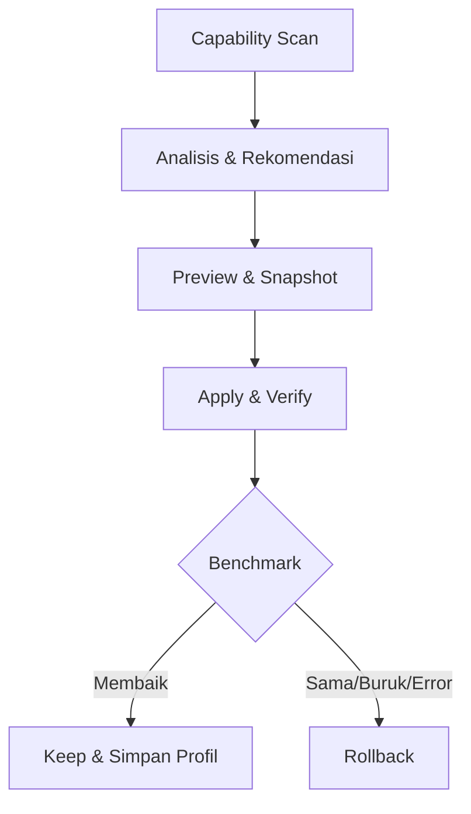

# BLUEPRINT LENGKAP — IPAN OPTIMIZER

> **Versi dokumen:** 2.0 — hardware-agnostic + lightweight UI revision  
> **Tanggal:** 26 Juli 2026  
> **Platform:** Windows 10, Windows 11, dan Windows custom/modifikasi secara best-effort  
> **Stack utama:** Python 3.12 x64, pywebview, HTML, CSS, JavaScript, SQLite  
> **Target khusus:** Semua game Windows, pekerjaan harian, BlueStacks, MSI App Player, Free Fire v7a/32-bit, Free Fire 64-bit, dan Free Fire MAX  
> **Target hardware:** Seluruh PC Windows x64 yang memenuhi prerequisite minimum—AMD/Intel, iGPU/dGPU AMD/NVIDIA/Intel, laptop/desktop, RAM dan jumlah core berbeda—melalui capability detection dan safe degradation

---

## 1. Ringkasan Eksekutif

IPAN Optimizer adalah aplikasi desktop Windows untuk menganalisis, merekomendasikan, menerapkan, mengukur, dan memulihkan optimasi performa PC.

Aplikasi ini **bukan kumpulan registry tweak sekali klik**. Arsitektur utamanya menggunakan pendekatan:

1. Memindai kemampuan dan kondisi PC.
2. Menentukan bottleneck yang benar-benar ada.
3. Menampilkan rekomendasi yang sesuai.
4. Memperlihatkan perubahan sebelum diterapkan.
5. Membuat snapshot lengkap.
6. Menerapkan perubahan secara transaksional.
7. Memverifikasi hasil perubahan.
8. Mengukur hasil sebelum dan sesudah.
9. Menyimpan tweak jika hasilnya membaik.
10. Melakukan rollback jika gagal, tidak relevan, atau menurunkan performa.

Tidak ada satu tweak yang pasti mempercepat seluruh game dan seluruh pekerjaan. Karena itu, klaim produk yang benar adalah:

> **Universal host optimizer dengan rekomendasi adaptif dan profil khusus per-game/per-emulator.**

Bukan:

> “Semua PC pasti naik FPS”, “0 ms latency”, atau “anti-ban 100%”.

Istilah “semua spesifikasi” pada dokumen ini berarti **semua konfigurasi x64 yang kompatibel dan lolos pemeriksaan kemampuan**, bukan janji bahwa setiap fitur tersedia pada PC yang berada di bawah requirement game/emulator, tidak memiliki komponen Windows yang dibutuhkan, atau memakai arsitektur yang belum diuji. Pada kondisi tersebut aplikasi harus menurunkan profil secara aman, menawarkan diagnosis saja, atau menandai fitur `Tidak tersedia`; aplikasi tidak boleh menerapkan angka milik PC lain secara buta.

---

## 2. Tujuan Produk

### 2.1 Tujuan utama

- Membuat Windows terasa lebih responsif untuk penggunaan harian.
- Mengurangi aplikasi startup dan proses latar belakang yang tidak diperlukan.
- Memastikan game memakai GPU yang benar.
- Memastikan refresh rate, power mode, dan resource allocation sesuai.
- Membantu menemukan masalah driver, storage, RAM, pagefile, temperatur, jaringan, dan virtualisasi.
- Menyediakan profil game yang berlaku sementara selama sesi bermain.
- Mengoptimalkan BlueStacks dan MSI App Player berdasarkan versi dan jenis instance.
- Menyediakan profil aman untuk Free Fire 32-bit dan 64-bit.
- Mengukur perubahan secara objektif.
- Menjamin setiap perubahan yang didukung dapat dipulihkan.
- Dapat digunakan oleh teknisi IPAN Store pada PC pelanggan yang berbeda-beda.

### 2.2 Tujuan sekunder

- Menghasilkan laporan kondisi PC.
- Membandingkan benchmark antarprofil.
- Mengekspor dan mengimpor profil tanpa script arbitrer.
- Menjelaskan alasan teknis setiap rekomendasi.
- Menjadi katalog optimasi yang dapat diperbarui melalui manifest bertanda tangan.

### 2.3 Bukan tujuan aplikasi

- Bukan cheat.
- Bukan anti-cheat bypass.
- Bukan APK modifier.
- Bukan game memory editor.
- Bukan macro atau recoil tool.
- Bukan alat memodifikasi packet game.
- Bukan debloater yang menghapus komponen Windows secara massal.
- Bukan driver updater dari sumber tidak resmi.
- Bukan aplikasi yang menjanjikan hasil sama pada semua PC.

---

## 3. Prinsip Produk

### 3.1 Evidence-based

Setiap tweak memiliki:

- Sumber resmi atau bukti benchmark.
- Tingkat bukti.
- Kondisi ketika tweak relevan.
- Potensi manfaat.
- Risiko.
- Dampak keamanan.
- Cara verifikasi.
- Cara rollback.

### 3.2 Capability-based

Kompatibilitas tidak boleh hanya bergantung pada nama Windows atau nomor build. Aplikasi harus memeriksa apakah API, service, registry key, runtime, driver, atau file konfigurasi yang dibutuhkan benar-benar tersedia.

### 3.3 Reversible by default

Tidak ada perubahan tanpa snapshot. Perubahan yang tidak dapat dipulihkan harus ditolak atau membutuhkan alur khusus yang sangat jelas.

### 3.4 Least privilege

Aplikasi utama berjalan sebagai pengguna biasa. Hak administrator diminta hanya untuk operasi tertentu melalui helper terpisah.

### 3.5 Honest measurement

Jika hasil benchmark berada dalam margin error, aplikasi harus menampilkan:

> **Tidak ada perubahan bermakna.**

Bukan mengarang peningkatan performa.

### 3.6 Safe degradation

Jika Windows custom menghapus WMI, WebView2, service, atau komponen lain, aplikasi memberikan status `Tidak tersedia` dan tetap menjalankan fitur lain yang kompatibel.

### 3.7 Local-first

- Berfungsi offline setelah prerequisite terpasang.
- Tidak menggunakan CDN.
- Tidak mengirim informasi PC secara otomatis.
- Tidak memiliki telemetry pada versi awal.

### 3.8 Hardware-agnostic

- Tidak ada preset yang dikunci ke Ryzen 5 5500, RX 6600 XT, merek tertentu, atau jumlah RAM tertentu.
- Model CPU/GPU hanya menjadi fakta diagnostik; keputusan berasal dari capability, resource headroom, suhu, power source, driver, display, dan hasil benchmark.
- Angka alokasi emulator dihitung ulang pada setiap PC dan setiap sesi.
- Vendor-specific rule hanya muncul jika vendor, driver, API, dan target executable yang tepat terdeteksi.
- PC referensi boleh menjadi fixture pengujian, tetapi tidak boleh menjadi sumber default universal.

---

## 4. Pengguna dan Skenario

### 4.1 Pengguna rumahan

Ingin PC lebih responsif tanpa memahami registry, service, power plan, atau konfigurasi emulator.

### 4.2 Gamer Windows

Ingin mengurangi gangguan background, memastikan GPU dan refresh rate benar, serta membandingkan frametime.

### 4.3 Pemain Free Fire emulator

Ingin profil yang sesuai untuk:

- Free Fire v7a/ARM32 pada Nougat 32-bit.
- Free Fire ARM64 pada Pie 64-bit.
- Free Fire MAX.
- BlueStacks.
- MSI App Player.

### 4.4 Teknisi IPAN Store

Membutuhkan:

- Scan cepat.
- Rekomendasi transparan.
- Preset layanan.
- Laporan sebelum/sesudah.
- Riwayat perubahan.
- Rollback ketika pelanggan mengalami masalah.
- Profil yang dapat dipakai ulang tanpa mengasumsikan semua PC sama.

---

## 5. Dukungan Sistem Operasi

| Platform | Status | Strategi |
|---|---|---|
| Windows 10 22H2 | Didukung dengan peringatan | Fitur berjalan jika capability tersedia; tampilkan peringatan bahwa dukungan reguler Microsoft berakhir 14 Oktober 2025 |
| Windows 11 24H2 | Didukung utama | Uji seluruh fitur yang relevan |
| Windows 11 25H2 | Didukung utama | Uji seluruh fitur yang relevan |
| Versi Windows 11 lebih baru | Best-effort | Capability detection dan rule compatibility |
| Windows custom/mod | Best-effort | Jangan memulihkan komponen yang sengaja dihapus; tandai fitur yang hilang |
| Windows 7/8 | Tidak didukung | Jangan menjanjikan pywebview/WebView2 dan dependency modern bekerja |

### 5.1 Peringatan Windows 10

Windows 10 dapat tetap menjalankan aplikasi, tetapi aplikasi harus memberikan informasi bahwa dukungan reguler Microsoft telah berakhir. Aplikasi tidak boleh menyembunyikan risiko keamanan tersebut.

### 5.2 Kompatibilitas Windows custom

Deteksi minimal:

- WebView2 tersedia atau tidak.
- WMI/CIM tersedia atau tidak.
- Power service tersedia atau tidak.
- Task Scheduler tersedia atau tidak.
- Windows Security API tersedia atau tidak.
- Hyper-V API dan hypervisor tersedia atau tidak.
- Service atau registry target tersedia atau tidak.
- File konfigurasi emulator dapat dibaca atau tidak.

Jika komponen hilang:

- Jangan crash.
- Jangan membuat nilai registry secara buta.
- Jangan mengaktifkan kembali service tanpa penjelasan.
- Jangan mengunduh komponen secara diam-diam.
- Tampilkan alasan dan solusi manual bila ada.

### 5.3 Batas platform dan prerequisite minimum

Versi 1 ditargetkan untuk Windows x64 karena runtime Python, helper, provider registry, dan dependency native harus diuji sebagai satu paket. Windows on ARM64 tidak boleh diklaim didukung hanya karena emulasi x64 mungkin berjalan; buat build dan matriks uji ARM64 terpisah sebelum mengubah statusnya dari `Unknown/read-only`.

Prerequisite aplikasi:

- Windows 10/11 x64 yang masih dapat menjalankan runtime yang dibundel.
- WebView2 Evergreen atau Fixed Version yang sudah diverifikasi.
- Minimal 2 logical processor dan 4 GB RAM untuk fungsi scan/diagnosis.
- Ruang disk yang cukup untuk aplikasi, log, snapshot, dan transaksi.
- Hak administrator hanya ketika rule tertentu memang membutuhkannya.

Requirement game dan emulator tetap milik vendor. Lolos prerequisite IPAN Optimizer tidak berarti PC otomatis memenuhi requirement BlueStacks, MSI App Player, Free Fire, atau game lain.

### 5.4 Model adaptasi hardware universal

Capability scanner membangun `MachineCapabilityVector`, bukan satu label “PC kentang/mid/high”:

| Dimensi | Fakta minimum yang dibaca | Pemakaian |
|---|---|---|
| CPU | vendor, architecture, physical core bila tersedia, logical processor, virtualization, load, frequency/throttle signal | Menentukan dukungan emulator dan batas vCPU |
| Memory | total, available, commit charge, commit limit, system-managed pagefile | Menentukan headroom, bukan sekadar total RAM |
| GPU | seluruh adapter, dedicated/shared memory, driver, API capability, display attachment | Memilih executable-to-GPU dan rule vendor yang benar |
| Storage | media type bila dapat dipercaya, free space, active time, TRIM capability | Diagnosis stutter/loading dan operasi maintenance |
| Display | resolution, refresh, VRR/DRR capability, multi-monitor | Audit refresh, FPS cap, dan present mode |
| Power/thermal | AC/battery, power scheme, temperature/throttle signal bila tersedia | Mencegah profil agresif pada baterai atau saat throttling |
| OS/security | build, edition, service/API yang tersedia, VBS/HVCI, hypervisor | Menentukan dukungan setiap rule tanpa merusak keamanan |
| Emulator | product, version, engine, instance ABI/Android, process, config schema | Memilih adapter dan profil Free Fire yang kompatibel |

Setiap fitur menghasilkan salah satu status:

| Status | Arti |
|---|---|
| `SUPPORTED` | Capability dan headroom memenuhi rule |
| `SUPPORTED_DEGRADED` | Fitur dapat berjalan dengan target lebih rendah dan penjelasan terbuka |
| `UNAVAILABLE` | Requirement tidak terpenuhi; jangan paksa |
| `UNKNOWN_READ_ONLY` | Versi/schema belum dikenal; hanya scan dan backup |

### 5.5 Resource budget untuk emulator

Jangan menggunakan tabel RAM/core statis sebagai satu-satunya keputusan. Hitung:

```text
host_reserve_mb =
  max(3072, ceil_to_512(0.30 × total_ram_mb))

safe_emulator_ram_cap_mb =
  floor_to_512(
    max(0,
      min(
        total_ram_mb - host_reserve_mb,
        available_ram_mb - 2048
      )
    )
  )

detected_physical_core_budget =
  physical_cores jika nilainya dapat dipercaya,
  selain itu max(1, floor(logical_processors / 2))

safe_emulator_cpu_cap =
  max(0,
    min(
      detected_physical_core_budget,
      logical_processors - 2
    )
  )
```

Aturan:

- `ceil_to_512` dan `floor_to_512` bekerja dalam kelipatan 512 MB.
- Sisakan minimal dua logical processor dan headroom host; jangan mengalokasikan seluruh resource.
- Nilai akhir adalah `min(target_vendor, safe_cap)`.
- Jika nilai akhir di bawah minimum yang didokumentasikan, tampilkan `UNAVAILABLE` atau `SUPPORTED_DEGRADED` hanya ketika instance yang sudah ada memang dapat berjalan; jangan menyebutnya optimal.
- Gunakan available memory dan commit headroom aktual. Jangan menganggap RAM kosong hanya dari total RAM.
- Pada baterai, suhu tinggi, memory pressure, atau disk pressure, turunkan target dan jelaskan penyebabnya.
- RAM besar bukan alasan untuk mengalokasikan sebanyak mungkin; alokasi berhenti pada kebutuhan profil yang terukur.

---

## 6. Klasifikasi Tweak

### 6.1 Level risiko

| Level | Makna | Perilaku |
|---|---|---|
| Safe | Didukung dokumentasi, dapat dipulihkan, risiko rendah | Boleh masuk profil default |
| Conditional | Hanya berguna pada kondisi tertentu | Harus melalui capability check |
| Experimental | Hasil sangat tergantung game/driver/hardware | Wajib warning dan benchmark |
| Prohibited | Berbahaya, placebo, keamanan buruk, atau berhubungan dengan cheat | Tidak boleh diimplementasikan |

### 6.2 Level bukti

| Level | Keterangan |
|---|---|
| Vendor documented | Dijelaskan Microsoft, AMD, NVIDIA, Intel, BlueStacks, MSI, Android, atau Garena |
| Repeatable benchmark | Terbukti melalui benchmark berulang dan metodologi jelas |
| Diagnostic heuristic | Rekomendasi berdasarkan kondisi yang terdeteksi |
| Community hypothesis | Belum cukup bukti; tidak boleh masuk preset default |
| Rejected myth | Bertentangan dengan dokumentasi atau berisiko |

---

## 7. Katalog Tweak Aman

## 7.1 Startup audit

Fungsi:

- Menampilkan aplikasi startup.
- Menampilkan publisher dan lokasi file.
- Menampilkan status enabled/disabled.
- Menampilkan startup impact jika tersedia.
- Menandai file tidak ditemukan atau publisher tidak dikenal.
- Pengguna memilih item yang dinonaktifkan.

Larangan:

- Jangan menonaktifkan driver, audio, accessibility, antivirus, atau komponen penting secara otomatis.
- Jangan menghapus entry; ubah status dengan mekanisme yang dapat dipulihkan.

Manfaat:

- Boot/login lebih cepat.
- RAM, disk, dan CPU idle lebih rendah.

## 7.2 Background process audit

Fungsi:

- Mengurutkan proses berdasarkan CPU, RAM, disk, dan network.
- Menyediakan allowlist serta denylist.
- Menandai proses Windows dan security software.
- Meminta persetujuan sebelum menutup aplikasi.
- Memberi peringatan mengenai dokumen yang belum disimpan.

Mode:

- Scan-only.
- Close selected.
- Close when game starts.
- Restore/relaunch optional setelah game selesai.

## 7.3 Visual effects

Profil:

- Windows Default.
- Balanced.
- Best Performance.
- Custom.

Pengaturan visual dapat mengurangi beban desktop dan meningkatkan respons yang dirasakan, tetapi jangan diklaim sebagai peningkatan FPS besar.

## 7.4 Game Mode

- Deteksi kondisi saat ini.
- Tawarkan aktivasi jika didukung.
- Simpan nilai lama.
- Verifikasi setelah perubahan.
- Masukkan sebagai Safe Gaming, bukan “FPS booster pasti”.

## 7.5 GPU preference

- Temukan executable utama dan proses render game/emulator.
- Tampilkan seluruh GPU.
- Berikan pilihan high-performance GPU.
- Simpan preferensi lama.
- Hindari perubahan global driver.

Aturan lintas-hardware:

- Pada PC iGPU-only, jangan menyebut dGPU sebagai requirement; gunakan adapter yang tersedia dan turunkan resolusi/FPS bila hasil ukur memerlukannya.
- Pada sistem multi-GPU, petakan preferensi ke executable render yang benar, bukan launcher.
- Gunakan mekanisme Windows per-app sebagai jalur generik.
- Pengaturan AMD, NVIDIA, atau Intel hanya boleh dibuat per executable jika provider vendor, versi driver, dan capability terkait terdeteksi.
- Jangan memaksa Anti-Lag, Low Latency Mode, FreeSync, G-Sync, VSync, atau renderer secara global.
- Unknown GPU/driver tetap mendapat diagnosis generik dan status `UNKNOWN_READ_ONLY` untuk rule vendor-specific.

## 7.6 Refresh-rate audit

- Deteksi monitor, resolusi, dan refresh aktif.
- Bandingkan dengan refresh maksimum mode yang tersedia.
- Deteksi multi-monitor.
- Beri tahu jika monitor high-refresh sedang berjalan pada 60 Hz.
- Beri tahu jika Dynamic Refresh Rate membatasi skenario tertentu.
- Perubahan harus dipreview dan dapat dibatalkan.

## 7.7 Power session

Fungsi:

- Daftar power scheme.
- Ekspor/snapshot scheme aktif.
- Aktifkan mode yang dipilih hanya selama sesi game.
- Pulihkan scheme sebelumnya ketika game selesai atau aplikasi pulih dari crash.

Jangan:

- Membuat Ultimate Performance sebagai pilihan wajib.
- Menghapus power plan OEM.
- Memaksa minimum processor state 100% untuk semua penggunaan.

## 7.8 Storage health

- Kapasitas dan free space.
- SSD/HDD/NVMe bila dapat dideteksi.
- TRIM availability.
- Status Optimize Drives.
- Analisis file sementara yang aman.
- Preview ukuran sebelum cleanup.
- Lewati file yang sedang digunakan.

Jangan:

- Menghapus shader cache setiap boot.
- Menghapus Prefetch terus-menerus.
- Menjalankan defrag tradisional secara buta pada SSD.

## 7.9 Pagefile

Default rekomendasi:

- `System Managed`.

Diagnosis:

- RAM fisik.
- Current commit.
- Peak commit bila tersedia.
- Commit limit.
- Crash dump requirement.
- Ruang disk.

Jangan:

- Mematikan pagefile.
- Menggunakan satu angka “terbaik” untuk semua PC.
- Mengklaim pagefile adalah pengganti RAM fisik.

## 7.10 Virtualization

Deteksi:

- AMD-V/VT-x.
- Virtualization firmware state.
- Hyper-V.
- Windows Hypervisor Platform.
- Virtual Machine Platform.
- VBS.
- Memory Integrity/HVCI.
- Hypervisor sedang aktif atau tidak.

Tujuan:

- Menentukan kompatibilitas emulator.
- Tidak memaksa Hyper-V mati jika versi emulator mendukungnya.

## 7.11 Driver dan thermal diagnostics

- GPU vendor/model/driver version.
- CPU utilization dan frequency.
- Indikasi thermal throttling bila data tersedia.
- RAM pressure.
- Disk active time.
- Tautan vendor resmi.

Aplikasi tidak menginstal driver tidak resmi dan tidak memodifikasi BIOS.

## 7.12 Network diagnostics

Metrik:

- Ping.
- Jitter.
- Packet loss.
- Adapter link speed.
- Wi-Fi signal bila tersedia.
- Background network usage.
- Banyaknya adapter aktif.

Rekomendasi:

- Gunakan Ethernet jika Wi-Fi tidak stabil.
- Tutup download/upload berat.
- Perbaiki channel/router jika terbukti bermasalah.

Jangan:

- Mengklaim perubahan DNS menurunkan ping saat pertandingan.
- Mematikan Nagle atau TCP autotuning secara global.

---

## 8. Tweak Conditional dan Experimental

## 8.1 Hardware-Accelerated GPU Scheduling

- Deteksi dukungan GPU, WDDM, driver, dan kondisi saat ini.
- Terapkan hanya setelah pengguna memilih.
- Memerlukan reboot jika Windows memerlukannya.
- Gunakan benchmark A/B.
- Simpan hasil per kombinasi game, GPU, dan driver.

## 8.2 Optimizations for windowed games

- Hanya ditawarkan pada Windows dan game yang sesuai.
- Utamanya relevan pada DX10/DX11 windowed/borderless.
- Bukan tweak universal OpenGL/Vulkan/DX12.
- Gunakan per-app configuration ketika tersedia.

## 8.3 VSync, VRR, FreeSync, dan G-Sync

- Selalu per-game.
- Sediakan mode:
  - Stability.
  - Low Latency.
  - Tear-free.
- Jangan mengubah setting global tanpa persetujuan terpisah.
- Catat monitor refresh rate dan FPS cap dalam benchmark.

## 8.4 Low-latency driver features

- AMD Anti-Lag hanya jika GPU, driver, game, dan API mendukung.
- NVIDIA latency setting hanya pada jalur yang didukung.
- Jangan menampilkan fitur vendor yang tidak tersedia.
- Jangan memaksa fitur driver pada emulator OpenGL/Vulkan tanpa bukti.

## 8.5 Process priority

- Default tetap `NORMAL`.
- Eksperimen maksimum `ABOVE_NORMAL`.
- Berlaku hanya selama sesi.
- Pulihkan setelah sesi berakhir.
- Jangan menggunakan `HIGH` secara global.
- Jangan pernah menggunakan `REALTIME`.

## 8.6 CPU affinity

- Hanya untuk troubleshooting game tertentu.
- Default tidak diubah.
- Wajib benchmark.
- Pulihkan setelah sesi.

## 8.7 NIC advanced properties

- Snapshot setiap property beserta tipe datanya.
- Perubahan hanya per-adapter.
- Sediakan rollback.
- Uji latency, packet loss, throughput, dan CPU overhead.
- Jangan menonaktifkan seluruh offload secara massal.

## 8.8 SysMain, indexing, dan capture

Hanya ditawarkan bila diagnosis menunjukkan:

- Disk contention.
- Indexing aktif di waktu bermain.
- Capture/recording aktif dan mengganggu.

Tidak masuk profil aman secara default.

## 8.9 Hyper-V, VBS, dan Memory Integrity

- Tidak pernah dinonaktifkan otomatis.
- Tampilkan kegunaan keamanan.
- Tampilkan kebutuhan reboot.
- Tampilkan dampak kompatibilitas emulator.
- Wajib konfirmasi individual.
- Jangan masukkan ke Safe Daily atau Gaming Balanced.

---

## 9. Tweak yang Dilarang

Aplikasi harus menolak:

- Realtime priority.
- High priority untuk semua game/proses.
- Mematikan pagefile.
- Pagefile angka ajaib.
- HPET enable/disable packs.
- `useplatformclock`.
- `useplatformtick`.
- `tscsyncpolicy`.
- `disabledynamictick`.
- Permanent global timer-resolution changes.
- `SystemResponsiveness=0`.
- `GPU Priority=8`.
- `SFIO Priority=High`.
- Global `TcpAckFrequency`.
- Global `TCPNoDelay`.
- Global Nagle disabling.
- Mematikan Defender.
- Mematikan Firewall.
- Mematikan UAC.
- Mematikan Windows Update.
- Mematikan exploit mitigations.
- Mass service disabling.
- Mass UWP deletion.
- Continuous standby-list purge.
- Continuous working-set trimming.
- Prefetch deletion setiap boot.
- Shader-cache deletion setiap boot.
- Forced universal CPU affinity.
- USB polling-rate overclock.
- Menonaktifkan thermal protection.
- Unsigned driver installation.
- Game memory read/write.
- DLL injection.
- Packet editing.
- APK modification.
- ADB gameplay automation.
- Macro aim/recoil/fire.
- Anti-cheat bypass.
- Emulator-detection bypass.
- Free Fire client/data/INI/package modification.

Rule engine wajib mempunyai daftar kebijakan yang membuat manifest berisi operasi tersebut gagal divalidasi.

---

## 10. Profil Bawaan

## 10.1 Safe Daily

Isi:

- Startup audit.
- Background app recommendations.
- Visual effects Balanced.
- Storage analysis.
- Pagefile diagnosis.
- Driver and thermal report.
- Tidak mengubah keamanan.
- Tidak menyentuh timer, BCDEdit, TCP hack, atau service secara massal.

## 10.2 Gaming Balanced

Isi:

- Game Mode.
- High-performance GPU preference.
- Refresh-rate check.
- Session-only power profile.
- Tutup proses terpilih.
- Storage/RAM pressure check.
- Restore otomatis setelah game berhenti.

## 10.3 Competitive Experimental

Isi:

- Seluruh Gaming Balanced.
- HAGS A/B.
- Windowed optimization.
- VSync/VRR/FPS-cap comparison.
- Above Normal priority.
- Renderer comparison bila emulator.
- Wajib benchmark.
- Tidak mengubah fitur keamanan secara default.

## 10.4 Free Fire v7a/Nougat 32

Baseline vendor adalah **target yang diminta**, lalu resource budget pada Bagian 5.5 menentukan apakah target boleh diterapkan:

| Parameter | Target adaptif |
|---|---|
| Instance | Nougat 32-bit |
| ABI | ARM32/armeabi-v7a |
| CPU | Target 4 core; batasi dengan `safe_emulator_cpu_cap` |
| RAM emulator | Target 3072–4096 MB; batasi dengan `safe_emulator_ram_cap_mb` |
| Resolusi | Mulai 1280×720; turunkan hanya jika benchmark atau pressure membuktikan perlu |
| DPI | 160 atau 240, diuji visual dan input |
| Mode performa | High Performance |
| FPS | Mulai dari 60 stabil |
| GPU | Adapter terbaik yang tersedia untuk executable render emulator |
| Renderer | Bandingkan renderer yang tersedia |

Aturan:

- Jangan memaksakan 90 FPS jika instance/game tidak menyediakannya.
- Terapkan batas host dinamis; jangan memakai angka cadangan RAM tetap untuk semua PC.
- Jika PC tidak dapat mencapai target 4 core/3072 MB dengan aman, labeli sebagai degraded atau unavailable, bukan “optimized”.
- Pada iGPU/shared-memory, memory pressure dan renderer harus diuji karena VRAM tidak berdiri sendiri.
- Simpan backup konfigurasi emulator sebelum perubahan.

## 10.5 Free Fire 64/Pie 64

| Parameter | Target adaptif |
|---|---|
| Instance | Pie 64-bit atau instance modern kompatibel |
| ABI | ARM64/arm64-v8a |
| CPU | Target 4 core; batasi dengan resource budget |
| RAM emulator | Target 4096 MB; batasi dengan resource budget |
| Competitive | 1280×720 |
| Quality | 1920×1080 jika stabil |
| FPS | Guided 90 FPS jika didukung |
| GPU | Adapter terbaik yang tersedia untuk executable render emulator |
| Renderer | A/B benchmark |

Jangan menawarkan target 90 FPS hanya berdasarkan nama GPU. Syaratnya mencakup dukungan game/instance, frame-rate option, display mode, headroom CPU/GPU, suhu, dan frametime yang stabil.

## 10.6 Free Fire MAX

| Tujuan | Target CPU | Target RAM | FPS |
|---|---:|---:|---:|
| Performance | 4 core, dibatasi safe cap | 4096 MB, dibatasi safe cap | Hingga 120 jika didukung dan stabil |
| Quality | 4 core, dibatasi safe cap | 6144 MB hanya jika headroom aman | Disesuaikan dengan frametime |

RAM 6 GB hanya digunakan jika memory pressure host tetap aman. Jika target vendor tidak muat, turunkan kualitas/FPS terlebih dahulu; jangan mengambil seluruh RAM/core host.

## 10.7 Custom Profile

- Pengguna hanya memilih rule tervalidasi.
- Tidak menerima script bebas.
- Menampilkan konflik.
- Menampilkan total risiko.
- Menampilkan perubahan persistent dan session-only.

---

## 11. Alur Utama Aplikasi



### 11.1 Alur scan

1. Aplikasi memuat UI.
2. Memeriksa WebView2 dan dependency.
3. Mengambil informasi OS/hardware.
4. Mendeteksi capability.
5. Mendeteksi game dan emulator.
6. Menilai bottleneck.
7. Menghasilkan rekomendasi dengan alasan.

### 11.2 Alur apply

1. Pengguna memilih rule.
2. Aplikasi memvalidasi compatibility dan conflict.
3. Menampilkan exact diff.
4. Pengguna mengonfirmasi.
5. Aplikasi membuat transaksi.
6. Snapshot dilakukan.
7. Helper admin dipanggil jika perlu.
8. Operasi diterapkan.
9. Kondisi diverifikasi.
10. Transaksi dicatat.

### 11.3 Alur session optimization

1. Pilih profil game.
2. Preview perubahan sementara.
3. Snapshot.
4. Terapkan.
5. Jalankan atau attach ke proses game.
6. Monitor seluruh process tree.
7. Pulihkan setelah proses berhenti.
8. Jika aplikasi crash, lakukan recovery pada startup berikutnya.

---

## 12. Arsitektur Teknis

| Komponen | Fungsi |
|---|---|
| pywebview shell | Window native dan bridge JavaScript–Python |
| Frontend | UI HTML/CSS/JavaScript |
| API bridge | Kontrak sempit dan tervalidasi |
| Capability scanner | Deteksi OS, hardware, fitur, emulator |
| Recommendation engine | Menghubungkan capability dan rule |
| Rule engine | Membaca manifest dan mengecek policy |
| Transaction engine | Snapshot, apply, verify, rollback |
| Privileged helper | Operasi admin yang dibatasi |
| Emulator adapters | BlueStacks/MSI dan versi berbeda |
| Game session controller | Mengelola perubahan sementara |
| Benchmark engine | PresentMon, resource, network |
| Persistence | SQLite dan transaction journal |
| Evidence catalog | Sumber dan batasan tweak |
| Recovery manager | Pemulihan setelah crash/reboot |

### 12.1 Anggaran performa aplikasi

Angka berikut adalah **acceptance budget produk**, bukan klaim bahwa WebView2 memakai memori yang sama pada seluruh build Windows:

| Area | Budget awal |
|---|---|
| Frontend lokal | HTML + CSS + JavaScript awal ≤500 KiB uncompressed; tidak termasuk subset SVG berlisensi |
| JavaScript | Vanilla ES modules; total first-party awal ≤180 KiB uncompressed |
| CSS | Token + layout + component CSS ≤100 KiB uncompressed |
| Dependency UI | Tidak ada framework SPA, chart framework, webfont, CDN, animation library, video, atau 3D runtime |
| Startup | P50 ≤2 detik dan P95 ≤4 detik pada fixture 4-core/8 GB/SATA SSD setelah WebView2 siap |
| Navigasi | Feedback visual ≤100 ms; long task frontend >50 ms harus dipecah |
| Idle | Median CPU seluruh process tree <0,5% setelah 30 detik; tidak ada polling permanen |
| Memory | Target working set process tree ≤180 MB; >250 MB pada fixture yang sama memblokir rilis sampai dianalisis |
| Network | Nol request eksternal saat startup dan penggunaan normal offline |
| Sampling | Event-driven; sampling cepat hanya pada halaman monitor/benchmark yang terlihat |

Implementasi:

- Render shell dan route aktif saja; muat halaman, tabel besar, dan data evidence secara lazy.
- Gunakan event delegation, `DocumentFragment`, pagination/virtualization log, dan `requestAnimationFrame` untuk update visual.
- Pekerjaan WMI/CIM, filesystem, benchmark, dan hashing berjalan di worker/thread dengan cancellation; jangan memblokir UI thread.
- Hentikan atau perlambat sampler ketika window minimized/hidden.
- Gunakan SVG/CSS sederhana untuk grafik kecil. Jangan membawa library chart hanya untuk beberapa garis.
- Ukur cold/warm start, input latency, CPU idle, memory process tree, ukuran asset, dan jumlah timer pada CI/release.

---

## 13. Struktur Folder

```text
ipan-optimizer/
├── src/
│   ├── main.py
│   ├── app/
│   │   ├── api.py
│   │   ├── contracts.py
│   │   └── events.py
│   ├── core/
│   │   ├── capabilities.py
│   │   ├── recommendations.py
│   │   ├── rule_engine.py
│   │   ├── transactions.py
│   │   ├── snapshots.py
│   │   ├── verification.py
│   │   └── recovery.py
│   ├── operations/
│   │   ├── registry.py
│   │   ├── power.py
│   │   ├── process.py
│   │   ├── storage.py
│   │   ├── display.py
│   │   └── emulator_config.py
│   ├── adapters/
│   │   ├── bluestacks.py
│   │   ├── msi_app_player.py
│   │   ├── amd.py
│   │   ├── nvidia.py
│   │   └── intel.py
│   ├── benchmark/
│   │   ├── presentmon.py
│   │   ├── sampler.py
│   │   ├── network.py
│   │   └── analysis.py
│   ├── privileged/
│   │   ├── launcher.py
│   │   ├── helper.py
│   │   └── policy.py
│   ├── persistence/
│   │   ├── database.py
│   │   ├── migrations.py
│   │   └── repositories.py
│   ├── data/
│   │   ├── rules/
│   │   ├── profiles/
│   │   └── evidence/
│   └── frontend/
│       ├── index.html
│       ├── css/
│       │   ├── tokens.css
│       │   ├── base.css
│       │   ├── layout.css
│       │   └── components.css
│       ├── js/
│       │   ├── app.js
│       │   ├── router.js
│       │   ├── bridge.js
│       │   └── views/
│       └── assets/
│           └── icons/
│               └── fluent/
├── tests/
│   ├── unit/
│   ├── integration/
│   ├── security/
│   └── fixtures/
├── docs/
├── installer/
├── scripts/
├── SPEC.md
├── ARCHITECTURE.md
├── DESIGN_SYSTEM.md
├── PERFORMANCE_BUDGET.md
├── ASSET_PROVENANCE.md
├── THREAT_MODEL.md
├── TASKS.md
└── THIRD_PARTY_NOTICES.md
```

---

## 14. Rule Manifest

Contoh konseptual:

```yaml
id: windows.game_mode
schema_version: 1
revision: 1
title_id: Mode Game Windows
description_id: Memastikan Mode Game aktif ketika fitur didukung.
category: gaming
risk: safe
evidence_level: vendor_documented
scope: current_user
persistent: true

supports:
  operating_system:
    - windows_10
    - windows_11
  capabilities:
    - supported_game_mode_setting
  hardware_models: []

resource_policy:
  mode: capability_based
  minimums: {}
  safe_cap_provider: null

detect:
  operation: supported_setting_read
  target: windows.game_mode

apply:
  - operation: supported_setting_write
    target: windows.game_mode
    value: enabled

verify:
  operation: supported_setting_equals
  target: windows.game_mode
  expected: enabled

rollback:
  operation: restore_snapshot

conflicts: []
restart: none
security_impact: none_known

evidence:
  - title: Xbox Game Mode
    url: https://support.xbox.com/en-US/help/games-apps/game-setup-and-play/use-game-mode-gaming-on-pc
```

### 14.1 Kebijakan manifest

- Harus lolos JSON Schema/Pydantic.
- Tidak menerima command string arbitrer.
- Tidak boleh menunjuk path di luar allowlist.
- Tidak boleh mengandung operasi prohibited.
- `hardware_models` harus kosong untuk rule generik; rule vendor hanya memakai vendor/driver/API capability, bukan satu SKU sebagai default.
- Alokasi core/RAM emulator harus dihitung saat Preview dari scan terbaru, bukan disimpan sebagai angka final lintas-PC.
- Manifest dapat menyimpan target vendor dan minimum terdokumentasi, tetapi final value wajib melewati resource policy.
- External manifest harus ditandatangani.
- Tolak signature tidak valid.
- Tolak downgrade.
- Tolak schema version tidak dikenal.
- Built-in catalog tetap tersedia offline.

---

## 15. Transaction dan Rollback

### 15.1 State

- `PLANNED`
- `SNAPSHOTTED`
- `APPLYING`
- `APPLIED`
- `VERIFIED`
- `KEPT`
- `ROLLING_BACK`
- `ROLLED_BACK`
- `RECOVERY_REQUIRED`
- `FAILED_SAFE`

### 15.2 Data snapshot

- Nilai lama.
- Tipe registry lama.
- Nilai baru.
- Scope.
- Path yang tervalidasi.
- Isi/hash file lama.
- Active power scheme.
- Rule ID dan revisi.
- Waktu.
- Restart requirement.
- Verification result.
- Recovery action.

### 15.3 Persyaratan rollback

- Idempotent.
- Bisa dijalankan setelah crash.
- Tidak menghapus state baru milik pengguna secara buta.
- Mendeteksi conflict jika state berubah setelah apply.
- Memberikan pilihan restore/keep/manual review.

---

## 16. Privileged Helper

### 16.1 Main process

- Manifest `asInvoker`.
- Menjalankan UI dan scan non-admin.
- Tidak menyimpan token/secret di frontend.

### 16.2 Elevated helper

- Dipanggil dengan `runas`.
- Hanya untuk satu transaksi.
- Menggunakan nonce sekali pakai.
- Membaca typed operation plan.
- Memvalidasi ulang semua operasi setelah elevasi.
- Menolak arbitrary command.
- Menolak path traversal.
- Menolak registry target di luar policy.
- Menulis result record.
- Keluar setelah selesai.

### 16.3 Tidak digunakan pada versi awal

- Permanent Windows service.
- Kernel driver.
- Ring-0 monitoring.
- Code injection.

---

## 17. API Bridge

Metode yang diperbolehkan:

```text
scan_system()
get_scan_result(scan_id)
list_recommendations(scan_id)
list_profiles()
preview_transaction(rule_ids, profile_id)
apply_transaction(transaction_id)
get_transaction_status(transaction_id)
rollback_transaction(transaction_id)
list_recovery_items()
start_game_session(profile_id, executable_id)
stop_game_session(session_id)
discover_emulators()
get_emulator_instances(product_id)
preview_emulator_profile(instance_id, profile_id)
start_benchmark(config)
cancel_benchmark(benchmark_id)
get_benchmark_status(benchmark_id)
compare_benchmarks(ids)
list_activity_events(filter)
export_diagnostic_report(options)
```

Frontend tidak boleh mendapatkan:

- Generic shell execution.
- Generic filesystem access.
- Generic registry access.
- Arbitrary subprocess.
- Raw privileged helper control.

---

## 18. Database

Tabel minimal:

- `schema_migrations`
- `machines`
- `capability_scans`
- `capabilities`
- `games`
- `game_executables`
- `emulator_products`
- `emulator_instances`
- `profiles`
- `profile_rules`
- `tweak_rules`
- `transactions`
- `transaction_operations`
- `snapshots`
- `game_sessions`
- `benchmark_sessions`
- `benchmark_runs`
- `benchmark_metrics`
- `recommendations`
- `evidence_sources`
- `activity_events`
- `application_settings`

Data per-user disimpan pada LocalAppData. Data bersama installer/helper dapat menggunakan ProgramData dengan ACL yang benar.

---

## 19. BlueStacks dan MSI App Player

### 19.1 Discovery

- Cek uninstall registry entries.
- Cek executable dan service yang valid.
- Jangan mengasumsikan drive C.
- Jangan mengasumsikan satu nama folder.
- Identifikasi keluarga produk dan versi.

### 19.2 Instance detection

- Nougat 32.
- Nougat 64.
- Pie 64.
- Android 11.
- Android 13 atau versi baru jika format dikenal.
- ABI selection jika tersedia.

### 19.3 Config editing

- Backup sebelum edit.
- Parser yang mempertahankan key tidak dikenal.
- Atomic write.
- Hash sebelum/sesudah.
- Verifikasi sesudah restart instance.
- Jika schema tidak dikenal, gunakan read-only mode.

### 19.4 Hyper-V

- Deteksi kondisi host.
- Deteksi apakah versi/instance mendukung konfigurasi saat ini.
- Jangan menonaktifkan Hyper-V secara global hanya karena menggunakan emulator.

---

## 20. Benchmark

### 20.1 Backend

- PresentMon sebagai adapter opsional.
- ETW/resource sampler sebagai fallback.
- Import CSV.
- Tidak mengunduh tool secara diam-diam.

### 20.2 Metrik

- Median FPS.
- 1% low.
- 0.1% low.
- Median frametime.
- p95 frametime.
- p99 frametime.
- Stutter count.
- CPU utilization/frequency.
- RAM working set.
- System commit.
- GPU utilization jika tersedia.
- Disk active time.
- Temperatur jika tersedia.
- Ping.
- Jitter.
- Packet loss.

### 20.3 Metodologi

1. Warm-up.
2. Scene, map, dan setting sama.
3. Baseline 3–5 kali.
4. Ubah satu kelompok variabel.
5. Test 3–5 kali.
6. Gunakan median dan variasi.
7. Tandai hasil inconclusive jika masih dalam noise.
8. Simpan driver, renderer, resolution, cap, refresh rate, dan temperatur.

### 20.4 Hasil

- Improved.
- Regressed.
- Inconclusive.
- Invalid run.

Tidak ada persentase “boost” tanpa data benchmark.

---

## 21. UI/UX

### 21.1 Sasaran desain

UI adalah alat desktop teknis yang tenang, cepat, dan dapat dipercaya—bukan landing page, sci-fi HUD, atau “gaming booster” penuh efek. Rujukan utamanya adalah konsistensi, kesederhanaan, dan kejelasan navigasi Windows/Fluent. Sentuhan gaming datang dari warna biru, kepadatan data yang rapi, dan state sesi; bukan neon, bentuk agresif, atau ilustrasi generatif.

Prioritas:

1. Informasi dan tindakan utama terlihat tanpa scroll berlebihan.
2. Risiko, bukti, current/proposed state, dan rollback lebih menonjol daripada klaim performa.
3. Pengguna pemula dapat memakai rekomendasi; pengguna teknis dapat membuka detail.
4. Keyboard, screen reader, high-DPI, 100–200% scaling, dan reduced motion tetap berfungsi.
5. UI tetap responsif pada fixture 4-core/8 GB/iGPU.

### 21.2 Larangan visual anti-“AI slop”

Jangan membuat:

- hero besar, slogan pemasaran panjang, atau judul 40–72 px;
- gradient ungu-biru, gradient text, glassmorphism/blur di seluruh surface;
- neon glow, floating orb/blob, particle, grid cyberpunk, scanline, cursor trail, atau background animasi;
- card besar membulat untuk setiap potongan teks, card di dalam card, dan radius 16–32 px;
- deretan empat KPI generik, fake circular score, speedometer/gauge palsu, grafik dekoratif, atau angka “boost” tanpa benchmark;
- tombol pill di mana-mana, shadow pada setiap panel, border gradient, atau CTA “BOOST NOW”;
- robot, chip, otak, petir, roket, sparkle, magic-wand, atau ilustrasi AI;
- emoji sebagai ikon kontrol;
- ikon dari beberapa keluarga yang bentuk/stroke-nya tidak konsisten;
- ikon di setiap judul/label ketika teks sudah cukup jelas;
- animasi entrance bertahap, parallax, bounce, pulse tanpa batas, atau loading palsu;
- copy generik seperti “Unleash ultimate performance”, “PC Anda terbang”, atau “AI-powered optimization”.

### 21.3 Design tokens warna

Tidak ada gradient. Gunakan semantic token; jangan menaruh hex acak di component CSS.

| Token | Nilai dark default | Fungsi |
|---|---|---|
| `--color-bg-canvas` | `#0B1018` | Latar window |
| `--color-bg-sidebar` | `#0F1722` | Navigasi |
| `--color-surface-1` | `#151E2B` | Panel utama |
| `--color-surface-2` | `#1B2635` | Hover/selected/subpanel |
| `--color-border` | `#2B3A4D` | Border 1 px |
| `--color-text-primary` | `#E7EDF6` | Teks utama |
| `--color-text-secondary` | `#9AA9BC` | Teks sekunder |
| `--color-accent` | `#2F81F7` | Tombol utama, focus, selection |
| `--color-accent-hover` | `#58A6FF` | Hover |
| `--color-accent-muted` | `#173A63` | Selected background |
| `--color-success` | `#3FB950` | Sukses terverifikasi |
| `--color-warning` | `#D29922` | Conditional/perlu perhatian |
| `--color-danger` | `#F85149` | Error/destructive |

Aturan:

- Biru dan gray/navy mencakup mayoritas UI; success/warning/danger hanya membawa makna status.
- Teks normal dan kontrol memenuhi WCAG 2.2 AA; status tidak boleh dibedakan oleh warna saja.
- Focus ring 2 px memakai accent dengan kontras minimal 3:1 terhadap warna di sekitarnya.
- Sediakan high-contrast/fallback ketika `forced-colors` aktif.
- Light theme tidak wajib untuk v1; jangan membuat light theme setengah jadi.

### 21.4 Tipografi

Gunakan font sistem lokal:

```css
font-family: "Segoe UI Variable", "Segoe UI", system-ui, sans-serif;
```

| Peran | Ukuran/line-height | Weight |
|---|---:|---:|
| Caption/metadata | 12/16 px | 400 |
| Body/control | 14/20 px | 400 |
| Body emphasis | 14/20 px | 600 |
| Section heading | 18/24 px | 600 |
| Page title | 24/32 px | 600 |

- Gunakan satu font; tidak ada remote font.
- Sentence case untuk label dan judul UI Indonesia.
- Rata kiri secara default.
- Gunakan monospace sistem hanya untuk path, ID, hash, atau log teknis.
- Jangan memakai all-caps kecuali wordmark `IPAN OPTIMIZER` yang pendek.

### 21.5 Spacing, shape, dan elevation

- Grid dasar 4 px; spacing utama 8, 12, 16, 20, 24, dan 32 px.
- Control height 32 atau 36 px; target interaksi minimum 32×32 px.
- Radius: 4 px untuk input/small control, 6 px untuk button, 8 px untuk panel/dialog. Tidak ada pill kecuali status tag.
- Border 1 px menjadi pemisah utama.
- Shadow hanya untuk dialog, menu, tooltip, dan surface yang benar-benar overlay.
- Gunakan whitespace dan divider; jangan membungkus semua hal dalam card.

### 21.6 Ikon dan identitas merek

- Ikon UI hanya dari subset lokal **Microsoft Fluent System Icons** ukuran Regular 20/24 px, dengan lisensi MIT dan attribution di `THIRD_PARTY_NOTICES.md`.
- Vendorkan hanya SVG yang dipakai; gunakan `currentColor`, nama file stabil, dan `aria-hidden="true"` untuk ikon dekoratif.
- Icon-only button wajib memiliki tooltip dan `aria-label`; tindakan yang tidak familiar tetap memakai label teks.
- Jangan memakai Font Awesome, emoji, icon font, gambar dari pencarian, atau mencampur set ikon lain.
- **Gemini atau image generator tidak boleh membuat logo, app icon, ilustrasi, maupun ikon baru.**
- Sampai aset merek buatan manusia disediakan dan disetujui, UI memakai wordmark teks `IPAN OPTIMIZER`; build development memakai default executable icon. Catat kebutuhan aset final di `ASSET_PROVENANCE.md`.

### 21.7 Struktur desktop dan navigasi

Window minimum `1024×700`; target QA `1024×700`, `1280×800`, `1440×900`, dan scaling 100/125/150/200%.

- Title bar 44–48 px.
- Left navigation 224–232 px; compact 64–72 px pada lebar sempit.
- Content padding 24 px; pada 1024 px boleh turun ke 16 px.
- Maksimal enam tujuan utama terlihat sekaligus:
  1. Dashboard
  2. Scan & rekomendasi
  3. Profil & game
  4. Emulator
  5. Benchmark
  6. Restore
- Kelompok `Tools` menampung Startup & Background, Storage & Memory, Network, dan Activity.
- Settings serta About & Evidence berada di footer navigation.
- Hindari hierarchy lebih dari dua tingkat. Tampilkan breadcrumb jika detail memerlukan tingkat tambahan.
- Pada lebar <960 px, navigation menjadi compact/overlay; tabel boleh scroll horizontal di containernya, bukan seluruh page.

### 21.8 Komponen inti

Gunakan pola yang sesuai isi:

| Isi | Komponen |
|---|---|
| Daftar rekomendasi | List row dengan status, judul, alasan singkat, risk badge, chevron |
| Current vs proposed | Dua kolom/diff table |
| Process/startup/log | Data table dengan sorting, filter, sticky header, pagination/virtualization |
| Pilihan kecil | Radio, checkbox, segmented control seperlunya |
| Risiko/destructive | Inline warning lalu confirmation dialog dengan target dan rollback |
| Proses berjalan | Determinate progress jika jumlah tahap diketahui; spinner hanya jika >1 detik dan progress tidak diketahui |
| Bukti | Expandable evidence drawer dengan sumber dan tanggal verifikasi |

Tweak detail menampilkan:

- current state dan proposed state;
- status applicability;
- Safe/Conditional/Experimental;
- expected effect tanpa angka palsu;
- risiko dan dampak keamanan;
- evidence + tanggal verifikasi;
- persistent/session-only dan kebutuhan restart;
- preview diff, apply, verify, dan rollback.

Gunakan progressive disclosure: ringkasan satu baris dahulu, detail teknis ketika dibuka. Jangan menampilkan 14 card besar untuk 14 fitur.

### 21.9 Dashboard

Dashboard tidak memiliki “health/optimization score”. Gunakan:

- satu baris status snapshot/rollback;
- tekanan CPU/RAM/storage dalam list ringkas;
- GPU assignment dan refresh-rate mismatch;
- startup items yang layak ditinjau;
- emulator compatibility;
- rekomendasi terverifikasi per level risiko;
- tombol primer `Pindai PC` atau `Tinjau rekomendasi`, bukan `Boost`.

Nilai harus memiliki timestamp dan state `Memuat`, `Tidak tersedia`, `Tidak diketahui`, atau `Terukur`; jangan mengganti data hilang dengan nol.

### 21.10 Motion dan feedback

- Transition 120–180 ms ease-out hanya untuk hover, selection, expand/collapse, dan overlay.
- Hormati `prefers-reduced-motion: reduce`; hilangkan transisi non-esensial.
- Tidak ada looping animation kecuali progress proses yang benar-benar aktif.
- Setelah Apply, tampilkan state berurutan: snapshot → apply → verify → success/rollback.
- Toast hanya untuk hasil singkat; error yang membutuhkan tindakan tetap berada inline sampai diselesaikan.

### 21.11 Content design

- UI berbahasa Indonesia; developer docs dan prompt Antigravity boleh berbahasa Inggris.
- Gunakan istilah faktual: `3 rekomendasi tersedia`, `Perubahan belum diterapkan`, `Tidak ada perubahan bermakna`.
- Jangan memakai jargon “sensi”, “zero delay”, “FPS unlock”, atau “anti-lag” sebagai klaim tanpa konteks vendor dan benchmark.
- Button memakai verba spesifik: `Pindai`, `Pratinjau perubahan`, `Terapkan`, `Pulihkan`.
- Selalu jelaskan mengapa fitur unavailable/degraded.

### 21.12 Review anti-slop sebelum rilis

Setiap halaman harus lolos:

- screenshot comparison pada empat ukuran/scaling target;
- keyboard-only walkthrough dan focus order;
- contrast audit;
- audit jumlah card, radius, shadow, ikon, dan animasi;
- asset provenance check: tidak ada aset generatif/tidak berlisensi;
- performance budget pada Bagian 12.1;
- review manusia dengan pertanyaan: “Apakah elemen ini membantu keputusan, status, atau tindakan?” Jika tidak, hapus.

---

## 22. Security dan Anti-cheat

Threat model minimal:

- Malicious manifest.
- Manifest downgrade.
- IPC tampering.
- Privilege escalation.
- Replay nonce.
- Path traversal.
- Reparse-point/symlink attack.
- Registry path injection.
- TOCTOU antara preview dan apply.
- Corrupt emulator config.
- Corrupt transaction journal.
- Malicious profile import.
- Log injection.
- XSS dari hardware name/path/log.
- WebView external navigation.
- Dependency compromise.

Kontrol:

- Manifest signature.
- Typed operations.
- Allowlist.
- Strict schema.
- ACL.
- Atomic writes.
- Hash verification.
- HTML escaping.
- CSP.
- Disable arbitrary navigation.
- Open evidence URL melalui browser sistem dan allowlist.
- Dependency pinning.
- Code signing.

IPAN Optimizer tidak boleh mengakses memory game, menginjeksi DLL, memodifikasi packet, APK, client, anti-cheat, atau gameplay.

---

## 23. Packaging

### 23.1 Runtime

- Python 3.12 x64.
- pywebview stable 6.x yang telah diuji.
- WebView2 Evergreen.

### 23.2 Build

- PyInstaller `onedir`.
- Main EXE `asInvoker`.
- Helper EXE `requireAdministrator`.
- Asset lokal.
- Exact dependency lock.

### 23.3 Installer

- Inno Setup.
- Deteksi Windows version.
- Deteksi WebView2.
- Opsi instal WebView2 resmi dengan persetujuan.
- Verify digital signature prerequisite.
- Upgrade-safe.
- Clean uninstall.
- Tidak menghapus snapshot/report pengguna tanpa pilihan.

### 23.4 Release

- Code signing.
- SHA-256.
- Changelog.
- Third-party notices.
- Supported build matrix.
- Rollback test.

---

## 24. Pengujian

### 24.1 Automated

- Unit tests.
- Integration tests dengan fake Windows backend.
- Manifest schema tests.
- Policy/prohibited tweak tests.
- Transaction tests.
- Rollback idempotency.
- Crash recovery.
- Registry type preservation.
- Atomic file write.
- Power-plan restoration.
- Path traversal.
- Nonce replay.
- API validation.
- UI smoke test.
- Frontend asset-size budget.
- Long-task dan timer audit.
- Keyboard/focus regression.
- Contrast/token lint.
- Asset provenance dan license allowlist.
- Packaging smoke test.

Automated test dilarang mengubah host developer.

### 24.2 Compatibility matrix

- Windows 10 22H2.
- Windows 11 24H2.
- Windows 11 25H2.
- 2-core/4 GB/HDD/iGPU: scan-only/degraded behavior, tanpa klaim emulator optimal.
- 4-core/8 GB/iGPU/SATA SSD.
- 4-core/8-thread/8–16 GB/dGPU.
- 6-core/12-thread/16 GB/dGPU.
- 8+ core/32+ GB/multi-GPU.
- Laptop AC/battery serta thermal/power throttling.
- Non-admin.
- Hyper-V on/off.
- HAGS support/no support.
- WebView2 missing.
- WMI unavailable.
- Windows service missing.
- AMD/NVIDIA/Intel.
- Single/multi-monitor.
- BlueStacks current.
- BlueStacks 5.21.x.
- Satu BlueStacks legacy.
- MSI App Player current/legacy.
- Nougat32.
- Pie64.
- Unknown emulator config.
- Windows custom test VM dengan komponen yang dihapus.
- Windows on ARM64 negative/read-only test sampai build native dinyatakan didukung.

### 24.3 Manual game QA

- Game Windows DX11.
- Game DX12.
- Game OpenGL/Vulkan jika tersedia.
- Free Fire Nougat32.
- Free Fire Pie64.
- Free Fire MAX.
- Monitor 60 Hz.
- Monitor high-refresh.
- Session recovery setelah emulator crash.

---

## 25. Roadmap

### Fase 1 — Foundation

- Repository.
- pywebview shell.
- UI design system, token, icon provenance, dan anti-slop review rules.
- Performance-budget harness.
- Contracts.
- SQLite.
- Logging.
- Mock backend.

### Fase 2 — Read-only scan

- OS/hardware.
- Machine capability vector.
- Resource-budget calculator.
- Compatibility report.
- Game/emulator discovery.

### Fase 3 — Safety engine

- Rule schema.
- Snapshot.
- Dry run.
- Transaction.
- Verification.
- Rollback.
- Recovery.

### Fase 4 — Safe Daily

- Startup.
- Background.
- Visual effects.
- Storage.
- Pagefile.
- Game Mode.
- Display/power diagnostics.

### Fase 5 — Gaming session

- Game profiles.
- GPU preference.
- Power session.
- Process close selection.
- Process-tree monitoring.
- Restore on exit.

### Fase 6 — Emulator

- BlueStacks adapter.
- MSI adapter.
- Instance detection.
- Free Fire profiles.
- Requested-target/safe-cap/final-allocation resolver.
- Config backup/write/verify.

### Fase 7 — Benchmark

- PresentMon.
- Resource sampler.
- Network.
- Repeated-run analysis.
- Comparison UI.

### Fase 8 — Hardening

- Elevated helper.
- Signature.
- Threat-model tests.
- Cross-spec, DPI, accessibility, asset, dan performance-budget gates.
- Installer.
- Upgrade.
- Release checklist.

---

## 26. Definition of Done

Produk dianggap siap ketika:

- Berjalan tanpa admin untuk fungsi normal.
- Elevasi hanya saat dibutuhkan.
- Semua tweak memiliki detect, snapshot, apply, verify, dan rollback.
- Rollback idempotent.
- Crash recovery bekerja.
- Tidak crash pada komponen Windows yang hilang.
- Unknown emulator version menjadi read-only.
- Tidak ada prohibited tweak yang lolos.
- Tidak ada arbitrary command dari manifest/frontend.
- Test tidak mengubah host.
- UI berbahasa Indonesia.
- Tidak ada AI-generated icon, illustration, logo, emoji-control, atau aset tanpa provenance.
- UI tidak memakai gradient, glassmorphism massal, fake score/gauge, dan motion dekoratif.
- Seluruh viewport/scaling, keyboard, contrast, reduced-motion, dan performance budget lulus.
- Berfungsi offline.
- WebView2 prerequisite ditangani.
- Build PyInstaller dan installer berhasil.
- Benchmark membedakan improved/regressed/inconclusive.
- Free Fire profile tidak menyentuh APK, memory, packet, client, atau anti-cheat.
- Laporan perubahan dapat diekspor.

---

## 27. Referensi Utama

### Microsoft

- [Windows 10 support ended](https://support.microsoft.com/en-us/windows/deployment/updates-lifecycle/windows-10-support-has-ended-on-october-14-2025)
- [Windows performance tips](https://support.microsoft.com/en-us/windows/experience/performance-optimization/tips-to-improve-pc-performance-in-windows)
- [Startup applications](https://support.microsoft.com/en-us/windows/experience/startup-boot/configure-startup-applications-in-windows)
- [Background activity](https://support.microsoft.com/en-us/windows/experience/performance-optimization/manage-background-activity-for-apps-in-windows)
- [Game Mode](https://support.xbox.com/en-US/help/games-apps/game-setup-and-play/use-game-mode-gaming-on-pc)
- [Optimizations for windowed games](https://support.microsoft.com/en-us/windows/hardware/display-graphics/optimizations-for-windowed-games-in-windows-11)
- [Refresh rate](https://support.microsoft.com/en-us/windows/hardware/display-graphics/change-the-refresh-rate-on-your-monitor-in-windows)
- [Powercfg](https://learn.microsoft.com/en-us/windows-hardware/design/device-experiences/powercfg-command-line-options)
- [Optimize Drives](https://support.microsoft.com/en-us/windows/experience/storage-filemanagement/defragment-optimize-your-data-drives-in-windows)
- [Pagefile introduction](https://learn.microsoft.com/en-us/troubleshoot/windows-client/performance/introduction-to-the-page-file)
- [Pagefile sizing](https://learn.microsoft.com/en-us/troubleshoot/windows-client/performance/how-to-determine-the-appropriate-page-file-size-for-64-bit-versions-of-windows)
- [MMCSS](https://learn.microsoft.com/en-us/windows/win32/procthread/multimedia-class-scheduler-service)
- [timeBeginPeriod](https://learn.microsoft.com/en-us/windows/win32/api/timeapi/nf-timeapi-timebeginperiod)
- [High-resolution timestamps](https://learn.microsoft.com/en-us/windows/win32/sysinfo/acquiring-high-resolution-time-stamps)
- [BCDEdit options](https://learn.microsoft.com/en-us/windows-hardware/drivers/devtest/bcdedit--set)
- [Scheduling priorities](https://learn.microsoft.com/en-us/windows/win32/procthread/scheduling-priorities)
- [TCP options](https://learn.microsoft.com/en-us/windows/win32/winsock/ipproto-tcp-socket-options)
- [Network adapter tuning](https://learn.microsoft.com/en-us/windows-server/networking/technologies/network-subsystem/net-sub-performance-tuning-nics)
- [Windows Device Security](https://support.microsoft.com/en-us/windows/security/windows-security/device-security-in-the-windows-security-app)
- [Least privilege](https://learn.microsoft.com/en-us/windows/win32/secbp/running-with-administrator-privileges)
- [Restore points](https://learn.microsoft.com/en-us/windows/win32/sr/restore-points)
- [Hardware-accelerated GPU scheduling](https://devblogs.microsoft.com/directx/hardware-accelerated-gpu-scheduling/)
- [WebView2 distribution](https://learn.microsoft.com/en-us/microsoft-edge/webview2/concepts/distribution)
- [Windows navigation design basics](https://learn.microsoft.com/en-us/windows/apps/design/basics/navigation-basics)
- [Typography in Windows](https://learn.microsoft.com/en-us/windows/apps/design/signature-experiences/typography)
- [Fluent 2 design tokens](https://fluent2.microsoft.design/design-tokens)
- [Fluent 2 layout](https://fluent2.microsoft.design/layout)
- [WCAG 2.2 Quick Reference](https://www.w3.org/WAI/WCAG22/quickref/)

### Android, BlueStacks, MSI, dan Garena

- [Android ABI guide](https://developer.android.com/ndk/guides/abis)
- [Android 64-bit requirements](https://developer.android.com/google/play/requirements/64-bit)
- [BlueStacks Android versions](https://support.bluestacks.com/hc/en-us/articles/360058931031-How-to-utilize-the-different-Android-versions-available-on-BlueStacks-5)
- [BlueStacks requirements](https://support.bluestacks.com/hc/en-us/articles/360056129211-System-requirements-for-BlueStacks-5)
- [Free Fire recommended settings](https://support.bluestacks.com/hc/en-us/articles/360057784811-Recommended-settings-for-Free-Fire-on-BlueStacks-5)
- [Free Fire 90 FPS](https://support.bluestacks.com/hc/en-us/articles/360059304111-How-to-play-Free-Fire-at-90-FPS-on-BlueStacks-5)
- [Free Fire MAX](https://support.bluestacks.com/hc/en-us/articles/43864024050829-Free-Fire-MAX-on-PC-with-BlueStacks-5)
- [BlueStacks GPU settings](https://support.bluestacks.com/hc/en-us/articles/360054877891-How-to-use-GPU-settings-to-increase-gaming-performance-on-BlueStacks-5)
- [BlueStacks graphics renderer](https://support.bluestacks.com/hc/en-us/articles/360057389932-How-to-change-the-graphics-settings-on-BlueStacks-5)
- [MSI App Player](https://www.msi.com/Landing/appplayer)
- [Garena connection issues](https://ffsupport.garena.com/hc/en-us/articles/4412920964762-Connection-Issues)
- [Garena lag troubleshooting](https://ffsupport.garena.com/hc/en-us/articles/4412920970394-Troubleshooting-step-Game-Lag)
- [Garena Abuse Policy](https://ffsupport.garena.com/hc/en-us/articles/4412928339866-Abuse-Policy)

### Development dan benchmark

- [pywebview repository](https://github.com/r0x0r/pywebview)
- [pywebview architecture](https://pywebview.flowrl.com/guide/architecture)
- [pywebview bridge](https://pywebview.flowrl.com/guide/interdomain)
- [pywebview security](https://pywebview.flowrl.com/guide/security)
- [pywebview freezing](https://pywebview.flowrl.com/guide/freezing.html)
- [PyInstaller](https://www.pyinstaller.org/)
- [Microsoft Fluent System Icons](https://github.com/microsoft/fluentui-system-icons)
- [Web performance budgets](https://web.dev/articles/performance-budgets-101)
- [Rendering performance](https://web.dev/articles/rendering-performance)
- [PresentMon](https://github.com/GameTechDev/PresentMon)
- [GPUView](https://learn.microsoft.com/en-us/windows-hardware/drivers/display/using-gpuview)

---

## 28. Catatan Lisensi

Proyek open-source yang boleh dipelajari sebagai referensi arsitektur:

- [Chris Titus Tech WinUtil](https://github.com/ChrisTitusTech/winutil)
- [Sophia Script](https://github.com/farag2/Sophia-Script-for-Windows)
- [AtlasOS](https://github.com/Atlas-OS/Atlas)
- [OptimizerNXT](https://github.com/hellzerg/optimizerNXT)

Jangan menyalin kode GPL ke produk closed-source tanpa memenuhi kewajiban lisensinya. PresentMon berlisensi MIT dan tetap memerlukan attribution/notice yang sesuai jika dibundel.

---

## 29. Keputusan Final

Versi pertama yang paling tepat untuk dibangun adalah:

1. Read-only PC scanner.
2. Recommendation engine.
3. Transaction/rollback engine.
4. Safe Daily.
5. Gaming session.
6. BlueStacks/MSI adapters.
7. Free Fire profiles.
8. Benchmark comparison.
9. Privileged helper.
10. Installer dan hardening.

Urutan ini memastikan fondasi keselamatan selesai sebelum katalog tweak diperluas.
