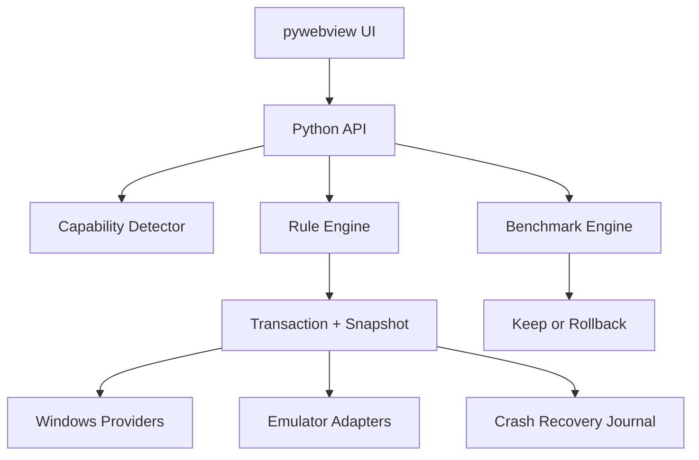

# Riset Tweak Gaming Windows 10/11 yang Berbasis Bukti

**Versi revisi:** 2.0 — hardware-agnostic + lightweight UI research  
**Tanggal riset:** 26 Juli 2026  
**Target aplikasi:** Python + pywebview (HTML/CSS/JavaScript)  
**Target penggunaan:** game PC, pekerjaan ringan, BlueStacks 5, MSI App Player, Free Fire 32-bit/v7a, Free Fire 64-bit Play Store, dan Free Fire MAX  
**Cakupan hardware:** PC Windows x64 AMD/Intel dengan iGPU/dGPU AMD, NVIDIA, atau Intel; laptop/desktop; resource rendah hingga tinggi  
**Kebijakan keamanan:** Microsoft Defender Antivirus tetap aktif

---

## 1. Kesimpulan utama

Tidak ada satu paket tweak yang meningkatkan semua game, semua emulator, dan semua komputer dengan hasil yang sama. Hal yang benar-benar dapat dibuat “universal” adalah mesin yang:

1. mendeteksi bottleneck dan kemampuan PC;
2. mengurangi kontensi CPU, RAM, disk, GPU, dan jaringan;
3. memakai pengaturan resmi Windows atau vendor;
4. menerapkan perubahan secara transaksional;
5. mengukur hasil A/B;
6. mempertahankan tweak hanya ketika hasilnya terbukti pada PC tersebut;
7. selalu dapat mengembalikan kondisi awal.

Dengan pendekatan itu, aplikasi dapat bekerja luas di Windows 10 dan 11. Namun tidak mungkin menjamin kompatibilitas dengan **setiap Windows custom/mod**: build seperti itu bisa menghapus service, paket Settings, WMI, Defender, Hyper-V, Task Scheduler, atau ACL yang dibutuhkan. Solusi yang benar adalah *capability detection*, bukan memaksa registry yang sama ke semua mesin.

Demikian pula, “semua spesifikasi PC” harus diterjemahkan sebagai **semua hardware kompatibel yang dapat dipindai dan memenuhi requirement fitur terkait**. PC di bawah requirement emulator tetap bisa memakai audit Windows, tetapi aplikasi harus menolak profil emulator yang tidak mempunyai headroom aman. Ini lebih universal daripada menyalin satu konfigurasi Ryzen/Radeon ke semua pengguna.

Microsoft mengakhiri dukungan reguler Windows 10 pada **14 Oktober 2025**. Aplikasi masih dapat mendukungnya secara teknis, tetapi harus menampilkan status bahwa sistem tersebut tidak lagi menerima pembaruan keamanan gratis reguler. [Microsoft: performance tips dan status Windows 10](https://support.microsoft.com/en-us/windows/experience/performance-optimization/tips-to-improve-pc-performance-in-windows)

### Klasifikasi yang dipakai

| Label | Arti | Boleh menjadi tombol satu klik? |
|---|---|---:|
| `RECOMMENDED` | Mekanismenya nyata, risikonya rendah, dan manfaatnya lintas aplikasi | Ya, setelah snapshot |
| `CONDITIONAL` | Bisa membantu konfigurasi/workload tertentu; wajib A/B test | Ya, tetapi lewat Experimental Lab |
| `MANUAL_ONLY` | Membutuhkan BIOS, keputusan keamanan, atau pengetahuan perangkat | Tidak otomatis |
| `AUDIT_RESTORE` | Aplikasi hanya mendeteksi nilai non-default dan menawarkan pemulihan | Hanya pemulihan |
| `REJECT` | Klaimnya salah, usang, placebo, atau risikonya tidak sebanding | Tidak |

“Meningkatkan performa” dalam laporan ini dapat berarti salah satu dari: waktu boot lebih singkat, respons desktop lebih cepat, FPS minimum lebih baik, frame-time lebih konsisten, input latency lebih rendah, loading lebih cepat, atau gangguan jaringan lebih sedikit. Itu tidak selalu berarti average FPS meningkat.

---

## 2. Dataset inti: tweak yang layak dimasukkan

### 2.1 Windows, proses, display, dan storage

| ID | Tweak | Status | Windows | Kondisi/deteksi | Implementasi aplikasi | Ukuran keberhasilan | Rollback |
|---|---|---|---|---|---|---|---|
| `WIN-GAME-MODE` | Game Mode aktif | `RECOMMENDED` | 10/11 | Deteksi nilai/status fitur; jangan menganggap key registry selalu sama pada semua build | Buka halaman Settings resmi atau gunakan pengaturan yang terdokumentasi; jangan mematikan service gaming secara massal | p95/p99 frame-time, aktivitas background saat game | Kembalikan status awal |
| `WIN-GPU-PREF` | GPU “High performance” per executable | `RECOMMENDED` | 10/11 | Berguna terutama bila ada iGPU+dGPU; nyaris netral pada PC satu GPU | Daftarkan executable game atau `HD-Player.exe` secara per-app; jangan memaksa global | GPU yang benar aktif, utilization, FPS/frame-time | Hapus/kembalikan preferensi per-app |
| `WIN-REFRESH` | Refresh rate tertinggi yang stabil | `RECOMMENDED` | 10/11 | Enumerasi mode yang benar-benar didukung monitor pada resolusi aktif | Tawarkan preview dan test; jangan membuat mode custom | refresh aktif, present rate, tearing, stabilitas | Kembali ke mode display sebelumnya |
| `WIN-DRR` | Dynamic Refresh Rate | `CONDITIONAL` | 11 | Hanya monitor VRR ≥120 Hz; Windows 10 tidak mendukung DRR | Pertahankan default; matikan per pengguna jika DRR membatasi refresh game | refresh aktual dan kelancaran | Kembalikan status awal |
| `WIN-WINDOWED-OPT` | Optimizations for windowed games | `RECOMMENDED` untuk kandidat yang didukung | 11 | DirectX 10/11, windowed/borderless | Aktifkan default; sediakan pengecualian per-app bila hasil A/B lebih buruk | display latency, p95/p99 frame-time | Status awal/per-app |
| `WIN-FSO` | Fullscreen Optimizations | `RECOMMENDED` dalam keadaan default | 10/11 | Jangan menonaktifkan secara global | Per-app disable hanya jika bug/input lag benar-benar dapat direproduksi | masalah hilang dan frame-time tidak memburuk | Hapus compatibility flag |
| `WIN-STARTUP` | Audit startup apps | `RECOMMENDED` | 10/11 | Tampilkan publisher, path, signature, dan startup impact | Pengguna memilih aplikasi non-esensial; jangan menonaktifkan driver, audio, input, keamanan, atau update secara otomatis | boot time, idle CPU/RAM/disk | Aktifkan kembali entri yang dipilih |
| `WIN-BACKGROUND` | Session background closer | `RECOMMENDED` | 10/11 | Hanya proses milik pengguna, bukan service/driver; buat allowlist dan denylist | Minta persetujuan per aplikasi, tutup secara normal, simpan daftar yang ditutup | CPU/RAM/disk/network sebelum-sesudah | Buka kembali hanya aplikasi yang aman diluncurkan |
| `WIN-VISUAL` | Visual effects responsif | `RECOMMENDED` opsional | 10/11 | Dampak lebih terasa pada PC lemah atau remote session | Preset “Balanced” dan “Best performance”; pertahankan font smoothing bila diinginkan | desktop/UI latency, bukan FPS saja | Pulihkan semua flag awal |
| `WIN-POWER-SESSION` | Power mode/plan hanya selama sesi game | `RECOMMENDED` | 10/11 | Desktop/AC; laptop harus mempertimbangkan baterai dan temperatur | Simpan GUID aktif, pilih Balanced atau High Performance yang sudah ada, lalu pulihkan ketika game selesai | clocks, p95 frame-time, temperatur, konsumsi daya | Aktifkan kembali GUID awal, termasuk setelah crash |
| `WIN-PAGEFILE` | Pagefile `System managed` | `RECOMMENDED` | 10/11 | Pantau commit peak dan ruang disk | Audit dan rekomendasikan System managed; jangan mematikan atau menetapkan angka “ajaib” | commit headroom, tidak ada OOM/freezing | Pulihkan konfigurasi awal |
| `WIN-STORAGE` | Storage health dan ruang kosong | `RECOMMENDED` | 10/11 | Deteksi SSD/HDD, free space, SMART bila tersedia | Gunakan Storage Sense/Windows Optimize Drives; optimasi sesuai tipe media | loading, disk queue, free space | Tidak perlu untuk analisis; deletion wajib terpilih pengguna |
| `WIN-SHADER-CACHE` | Pertahankan shader cache | `RECOMMENDED` | 10/11 | Reset hanya saat korup/driver bermasalah | Jangan memasukkan penghapusan shader cache ke “daily clean” | berkurangnya compile stutter setelah warm-up | Cache akan dibuat ulang; tidak ada instant rollback |
| `WIN-UPDATES` | Driver GPU/chipset dan Windows yang sehat | `RECOMMENDED` | 10/11 | Catat versi, tanggal, dan status reboot; jangan menganggap “terbaru” selalu terbaik | Beri diagnosis/update link vendor; sediakan driver rollback note | crash, device errors, frame-time | Driver rollback/System Restore sesuai kasus |
| `WIN-OVERLAY` | Audit overlay/recording | `CONDITIONAL` | 10/11 | Game Bar, Discord, Steam, Radeon/NVIDIA overlay, RGB/monitoring | Uji satu per satu; jangan mematikan aksesibilitas atau overlay yang dibutuhkan | p99 frame-time, crash/anti-cheat, fungsi pengguna | Aktifkan kembali |
| `WIN-THERMAL` | Thermal/throttling guard | `RECOMMENDED` | 10/11 | Monitor suhu, clock, utilization, dan power sebelum menyalahkan Windows | Hanya warning/rekomendasi; jangan mengatur fan/voltage tanpa integrasi vendor yang sah | clock tidak turun akibat throttle, konsistensi frame | Tidak ada perubahan otomatis |

Microsoft sendiri merekomendasikan pengurangan startup/background apps, pengaturan visual effects, mode daya sesuai kebutuhan, ruang penyimpanan, update, dan pemantauan resource. [Microsoft Windows performance guidance](https://support.microsoft.com/en-us/windows/experience/performance-optimization/tips-to-improve-pc-performance-in-windows)

[Xbox Support: Game Mode pada PC](https://support.xbox.com/en-US/help/games-apps/game-setup-and-play/use-game-mode-gaming-on-pc) adalah rujukan resmi untuk toggle Game Mode. Untuk startup, Task Manager juga memberi klasifikasi impact berbasis CPU dan disk sehingga aplikasi dapat memprioritaskan audit tanpa menebak dari nama proses. [Microsoft: Configure Startup applications](https://support.microsoft.com/en-us/windows/experience/startup-boot/configure-startup-applications-in-windows)

Microsoft menyatakan refresh lebih tinggi dapat mengurangi motion blur, tearing, dan input lag; Windows 11 DRR dapat membatasi refresh maksimum pada sebagian game sehingga harus dimatikan bila masalah itu muncul. [Microsoft: refresh rate dan DRR](https://support.microsoft.com/en-us/windows/hardware/display-graphics/change-the-refresh-rate-on-your-monitor-in-windows)

Optimizations for windowed games di Windows 11 mengganti presentasi DX10/11 windowed/borderless dari model lama ke flip model, mengurangi frame latency dan memungkinkan VRR/Auto HDR. Halaman yang sama mendokumentasikan GPU preference per aplikasi. [Microsoft: windowed game optimizations](https://support.microsoft.com/en-us/windows/hardware/display-graphics/optimizations-for-windowed-games-in-windows-11)

Microsoft memiliki data bahwa hampir semua pengguna memperoleh performa setara atau lebih baik dengan Fullscreen Optimizations; penonaktifan adalah langkah troubleshooting per-game, bukan tweak global. [Microsoft DirectX: Fullscreen Optimizations](https://devblogs.microsoft.com/directx/demystifying-full-screen-optimizations/)

Pagefile memperluas commit limit. Jika commit mencapai limit, aplikasi atau sistem dapat freeze/crash; karena itu pagefile-off bukan optimasi universal. [Microsoft: pagefile dan committed memory](https://learn.microsoft.com/en-us/troubleshoot/windows-client/performance/introduction-to-the-page-file)

Untuk storage, `Optimize-Volume` memilih operasi default menurut media: defrag untuk HDD dan ReTrim untuk SSD yang mendukung TRIM. Karena itu aplikasi tidak boleh menjalankan “defrag SSD” generik. [Microsoft: Optimize-Volume](https://learn.microsoft.com/en-us/powershell/module/storage/optimize-volume?view=windowsserver2025-ps)

### 2.2 Defender tetap aktif, tetapi overhead terukur

| ID | Tweak | Status | Implementasi | Catatan |
|---|---|---|---|---|
| `DEF-ANALYZER` | Defender Performance Analyzer | `RECOMMENDED` | Rekam workload yang benar-benar lambat, lalu baca file/path/process/extension dengan biaya scan terbesar | Membutuhkan PowerShell admin; didukung Windows 10/11 |
| `DEF-LOW-PRIORITY` | Low CPU priority untuk scheduled scan | `RECOMMENDED` | `EnableLowCpuPriority = true` | Tidak mematikan real-time protection |
| `DEF-IDLE-SCAN` | Scheduled scan saat PC idle | `RECOMMENDED` | `ScanOnlyIfIdleEnabled = true` | Jadwalkan di luar jam main |
| `DEF-CPU-GUIDANCE` | CPU guidance scheduled scan | `RECOMMENDED` konservatif | UI boleh menawarkan 20/25/30%; default Microsoft 50% | Ini rata-rata/guidance, bukan hard real-time cap; nilai rendah memperpanjang scan |
| `DEF-IDLE-THROTTLE` | Terapkan throttling juga saat idle scan | `CONDITIONAL` | `DisableCpuThrottleOnIdleScans = false` bila pengguna ingin batas CPU tetap berlaku | Jika bernilai true, CPU tidak di-throttle pada idle scan |
| `DEF-EXCLUSION` | Exclusion otomatis seluruh folder game/emulator | `REJECT` | Jangan dibuat | Setiap exclusion membuka celah proteksi; analyzer bukan rekomendasi exclusion |
| `DEF-PROTECTION` | Disable real-time/cloud/script/behavior protection | `REJECT` | Jangan dibuat | Bertentangan dengan requirement dan mengurangi keamanan |

Contoh diagnosis resmi:

```powershell
# Jalankan PowerShell sebagai Administrator.
New-MpPerformanceRecording -RecordTo "$env:TEMP\Defender-Gaming.etl"

# Reproduksi loading/stutter, lalu tekan Enter untuk menghentikan rekaman.
Get-MpPerformanceReport `
  -Path "$env:TEMP\Defender-Gaming.etl" `
  -TopFiles 10 `
  -TopProcesses 10 `
  -TopScans 20
```

Contoh profil scheduled scan yang tetap mempertahankan Defender:

```powershell
# Aplikasi wajib membaca dan menyimpan nilai lama terlebih dahulu.
Get-MpPreference |
  Select-Object EnableLowCpuPriority,
                ScanOnlyIfIdleEnabled,
                DisableCpuThrottleOnIdleScans,
                ScanAvgCPULoadFactor,
                ScanScheduleDay,
                ScanScheduleTime

Set-MpPreference -EnableLowCpuPriority $true
Set-MpPreference -ScanOnlyIfIdleEnabled $true
Set-MpPreference -DisableCpuThrottleOnIdleScans $false
Set-MpPreference -ScanAvgCPULoadFactor 25
```

Angka 25 adalah **preset konservatif rancangan aplikasi**, bukan angka universal dari Microsoft. Rentang resmi adalah 5–100, default 50, dan 0 mematikan CPU throttling. Rollback harus memakai nilai yang ditangkap dari PC pengguna, bukan hard-code “default”.

Microsoft menyediakan `New-MpPerformanceRecording` dan `Get-MpPerformanceReport` untuk menemukan path, file, extension, dan proses yang paling banyak membebani scan. Microsoft juga menegaskan exclusion mengurangi tingkat proteksi. [Defender Performance Analyzer](https://learn.microsoft.com/en-us/defender-endpoint/performance-analyzer-reference) dan [panduan penggunaan Windows 10/11](https://learn.microsoft.com/en-us/defender-endpoint/tune-performance-defender-antivirus)

Parameter scheduled scan di atas terdokumentasi dalam [Set-MpPreference](https://learn.microsoft.com/en-us/powershell/module/defender/set-mppreference?view=windowsserver2025-ps).

Jika pengguna tetap ingin mempertimbangkan exclusion setelah diagnosis, tampilkan peringatan dan dokumentasi resmi; jangan memilihkan path secara otomatis. [Microsoft: Defender Antivirus exclusions](https://learn.microsoft.com/en-us/defender-endpoint/microsoft-defender-antivirus-exclusions-overview)

### 2.3 Jaringan

| ID | Tweak | Status | Implementasi | Ukuran keberhasilan |
|---|---|---|---|---|
| `NET-LOAD-GUARD` | Deteksi download/upload aktif | `RECOMMENDED` | Peringatkan pengguna, identifikasi proses, jangan terminate service Windows Update | ping, jitter, packet loss, throughput background |
| `NET-DO-LIMIT` | Delivery Optimization bandwidth limit | `RECOMMENDED` opsional | Arahkan ke pengaturan/policy resmi dan jadwal jam; jangan mematikan Windows Update | bandwidth background dan jitter |
| `NET-ETHERNET` | Rekomendasi Ethernet | `RECOMMENDED` | Diagnosis jenis link, signal Wi‑Fi, reconnect, gateway loss | jitter/loss lebih stabil |
| `NET-TCP-AUDIT` | Audit TCP autotuning dan RSS | `RECOMMENDED` read-only | Tampilkan kondisi; pertahankan default normal bila tidak ada bukti masalah | throughput dan CPU network |
| `NET-INT-MOD` | Interrupt moderation | `CONDITIONAL` | A/B per NIC/driver; off dapat menurunkan latency mikro tetapi menaikkan penggunaan CPU | latency lokal, DPC, CPU, packet loss |
| `NET-DNS` | DNS resolver | `CONDITIONAL` | Uji lookup/reliability; jangan mengklaim menurunkan ping pertandingan | DNS lookup, bukan RTT server setelah tersambung |
| `NET-NAGLE` | Global `TCPNoDelay`/`TcpAckFrequency` registry | `REJECT` | Jangan terapkan | `TCP_NODELAY` adalah opsi per-socket; aplikasi/game yang tepat menentukannya |
| `NET-OFFLOAD-OFF` | Matikan RSS/LSO/checksum offload secara massal | `REJECT` | Jangan terapkan | Offload/RSS umumnya menghemat CPU/meningkatkan throughput; perubahan hanya untuk bug terukur |

Perintah audit read-only:

```powershell
netsh interface tcp show global

Get-NetTCPSetting |
  Select-Object SettingName, AutoTuningLevelLocal

Get-NetAdapter |
  Select-Object Name, Status, LinkSpeed, InterfaceDescription
```

Dokumentasi Microsoft menyatakan hasil optimal bergantung pada hardware dan workload. Interrupt moderation menukar penggunaan CPU dengan latency; offload dan RSS biasanya bermanfaat; tuning NIC hanya memengaruhi latency pemrosesan lokal dalam mikrodetik dan tidak mengurangi waktu paket di internet yang umumnya milidetik. [Microsoft: network adapter performance tuning](https://learn.microsoft.com/en-us/windows-server/networking/technologies/network-subsystem/net-sub-performance-tuning-nics)

Delivery Optimization mendukung pembatasan bandwidth foreground/background dan jadwal jam, sehingga lebih tepat membatasi gangguan download daripada mematikan update. [Microsoft: Delivery Optimization bandwidth](https://learn.microsoft.com/en-us/windows/deployment/do/delivery-optimization-configure)

Untuk Free Fire, Garena menyebut koneksi tidak stabil, terlalu banyak perangkat Wi‑Fi, background apps, dan active downloads sebagai sumber lag; ping ideal yang mereka tulis adalah ≤150 ms, dengan nilai lebih rendah lebih baik. [Garena: Connection Issues](https://ffsupport.garena.com/hc/en-us/articles/4412920964762-Connection-Issues)

### 2.4 Tweak yang wajib melalui A/B test

| ID | Tweak | Status | Default aplikasi | Alasan |
|---|---|---|---|---|
| `EXP-HAGS` | Hardware-accelerated GPU scheduling | `CONDITIONAL` | Jangan diubah otomatis | Microsoft menyebut transisinya seharusnya transparan dan pengguna biasanya tidak melihat perubahan besar; hasil bergantung GPU/driver/game |
| `EXP-PRIORITY` | Process priority `AboveNormal` | `CONDITIONAL` | `Normal` | Bisa membantu saat ada kontensi CPU; dapat memindahkan masalah ke audio/input/background |
| `EXP-HIGH-PRIORITY` | `High` | `MANUAL_ONLY`/tidak disarankan | Off | Microsoft memperingatkan thread high priority dapat menghilangkan waktu CPU bagi thread lain |
| `EXP-REALTIME` | `Realtime` | `REJECT` | Tidak tersedia | Dapat mengganggu input mouse/keyboard dan disk flushing |
| `EXP-AFFINITY` | CPU affinity manual | `CONDITIONAL` | Semua core/OS-managed | Hanya untuk bug engine, multi-CCD, hybrid core, atau contention tertentu setelah ukur; jangan memakai pola core ganjil/genap universal |
| `EXP-FPS-CAP` | FPS cap | `CONDITIONAL` | Per-game | Dapat memperbaiki frame pacing, suhu, dan latency pada GPU-bound/VRR; nilai bergantung monitor/game |
| `EXP-VSYNC-VRR` | VSync/VRR/Enhanced Sync | `CONDITIONAL` | Per-game | Trade-off tearing, queue, dan latency berbeda setiap game |
| `EXP-ANTI-LAG` | AMD Anti-Lag | `CONDITIONAL` | Per-game | Resmi mendukung DX9/11/12; emulator OpenGL/Vulkan tidak tercakup |
| `EXP-SAM` | Smart Access Memory/ReBAR | `MANUAL_ONLY` | Audit capability | Manfaat hanya pada judul tertentu dan membutuhkan motherboard/BIOS yang sesuai |
| `EXP-XMP` | XMP/DOCP/EXPO | `MANUAL_ONLY` | Audit frequency saja | Dapat menaikkan bandwidth RAM tetapi perubahan BIOS harus stability-tested |
| `EXP-HVCI` | Memory Integrity/HVCI | `MANUAL_ONLY` | Pertahankan keadaan awal | Mematikannya mengurangi proteksi kernel; bukan default tweak aplikasi |
| `EXP-AUDIO` | Audio enhancements/spatial audio | `CONDITIONAL` | Pertahankan | Uji hanya bila ada DPC/audio crackle/latency terukur |

HAGS memerlukan dukungan hardware dan driver WDDM 2.7. Microsoft menjelaskan fitur ini sebagai perubahan fundamental yang awalnya opt-in, dan tidak mengharapkan perubahan performa yang signifikan bagi mayoritas aplikasi. [Microsoft DirectX: HAGS](https://devblogs.microsoft.com/directx/hardware-accelerated-gpu-scheduling/)

Windows memakai `Normal` sebagai process priority default. Microsoft memperingatkan `High` harus dipakai dengan hati-hati dan `Realtime` hampir tidak pernah boleh dipakai karena dapat mengganggu thread sistem, mouse, keyboard, dan disk flushing. [Microsoft: scheduling priorities](https://learn.microsoft.com/en-us/windows/win32/procthread/scheduling-priorities)

Memory Integrity/HVCI menjalankan proteksi kernel dalam lingkungan virtualisasi dan menyulitkan driver berbahaya mengambil alih PC. Jika ingin menyediakan eksperimen performa, tampilkan sebagai keputusan keamanan manual dengan benchmark dan pemulihan—jangan menjadi preset “Boost”. [Microsoft: Memory Integrity](https://support.microsoft.com/en-us/windows/security/windows-security/device-security-in-the-windows-security-app)

---

## 3. Audit tweak internet yang populer tetapi tidak universal

Bagian ini sengaja tidak dihilangkan. Tweak berikut memang beredar luas, tetapi hasil riset primer tidak mendukungnya sebagai “works all game”.

| Klaim populer | Fakta teknis | Putusan aplikasi |
|---|---|---|
| `bcdedit /set useplatformclock yes` meningkatkan latency/FPS | Microsoft menandai `useplatformclock` hanya untuk debugging; Windows memilih sumber QPC sesuai hardware | `AUDIT_RESTORE` |
| `disabledynamictick yes`, `useplatformtick yes`, `tscsyncpolicy Enhanced` selalu lebih cepat | Microsoft menandai opsi timer/tick tersebut untuk debugging; perubahan BCD juga dapat membuat sistem tidak dapat boot | `AUDIT_RESTORE` |
| Paksa timer 0.5/1 ms selamanya | Sejak Windows 10 2004, `timeBeginPeriod` terutama process-scoped; resolusi tinggi dapat menurunkan performa total dan menghambat power management; harus dipasangkan dengan `timeEndPeriod` | `REJECT` untuk global timer service |
| `SystemResponsiveness=0` memberi 100% CPU ke game | Microsoft menyatakan nilai di bawah 10 atau di atas 100 dijepit menjadi 20 | `AUDIT_RESTORE` |
| `GPU Priority=8` menaikkan prioritas GPU | Microsoft menyatakan field MMCSS `GPU Priority` belum digunakan | `REJECT` |
| `SFIO Priority=High` mempercepat I/O game | Microsoft menyatakan field tersebut tidak digunakan | `REJECT` |
| Ubah `Clock Rate` MMCSS untuk timer lebih cepat | Jaminan Clock Rate dihapus sejak Windows 7/Server 2008 R2 | `REJECT` |
| Realtime priority menghilangkan input delay | Bisa mengganggu thread mouse, keyboard, audio, dan disk flushing | `REJECT` |
| High priority untuk setiap game | Bisa membuat thread sistem/driver kekurangan waktu CPU | `CONDITIONAL`, maksimal `AboveNormal` sebagai eksperimen |
| Disable pagefile dengan RAM 16/32 GB | Mengurangi commit limit dan dukungan crash dump; dapat menyebabkan freeze/crash pada peak commit | `REJECT` |
| Kosongkan standby list setiap beberapa menit | Tidak ada bukti vendor bahwa ini meningkatkan semua game; cache yang berguna akan dimuat ulang | `REJECT` sebagai loop/background service |
| Hapus Prefetch/shader cache setiap boot | Shader cache dibuat untuk mengurangi kompilasi ulang dan CPU usage; reset hanya untuk troubleshooting korupsi | `REJECT` untuk routine cleaner |
| Matikan semua telemetry/services/indexing/SysMain | Dampak bergantung workload dan dapat merusak Search, Store, update, device discovery, networking, atau launcher | `REJECT` sebagai preset universal |
| Disable Fullscreen Optimizations global | Telemetry Microsoft menunjukkan performa rata-rata setara atau lebih baik; disable hanya per game bermasalah | `REJECT` global |
| Disable RSS, LSO, checksum offload | Menghilangkan offload CPU/parallel receive; hanya layak untuk bug driver yang dibuktikan | `REJECT` global |
| Registry `TCPNoDelay`/`TcpAckFrequency` mengurangi ping semua game | Nagle/TCP_NODELAY adalah keputusan per-socket dan banyak game memakai UDP; tidak mengubah rute WAN | `REJECT` global |
| Ganti DNS untuk menurunkan in-match ping | DNS hanya menyelesaikan nama; setelah koneksi terbentuk, resolver tidak mengubah jalur ke server | `REJECT` sebagai klaim ping; boleh untuk reliability |
| Disable Defender atau exclude seluruh folder game | Mengurangi proteksi; overhead seharusnya didiagnosis dengan Performance Analyzer dan scan dijadwalkan | `REJECT` |
| Disable Memory Integrity/VBS pada semua PC | Ada trade-off keamanan kernel; efek performa berbeda berdasarkan hardware/workload | `MANUAL_ONLY` |
| Minimum processor state 100%, C-state off, Ultimate Performance 24/7 | Dapat menaikkan idle power/suhu dan mengurangi thermal headroom; manfaat tidak universal | `REJECT` global; A/B sesi bila diperlukan |
| “One-click debloat” menghapus semua AppX/service | Build/edition/language/OEM berbeda; dependensi mudah rusak dan rollback sering tidak lengkap | `REJECT` |

Rujukan primer untuk timer dan MMCSS:

- [Microsoft: BCDEdit `/set`](https://learn.microsoft.com/en-us/windows-hardware/drivers/devtest/bcdedit--set) — `useplatformclock`, `tscsyncpolicy`, `disabledynamictick`, dan `useplatformtick` dijelaskan sebagai opsi debugging.
- [Microsoft: QueryPerformanceCounter guidance](https://learn.microsoft.com/en-us/windows/win32/sysinfo/acquiring-high-resolution-time-stamps) — Windows memilih counter yang sesuai; aplikasi tidak perlu memaksa sumber timer.
- [Microsoft: `timeBeginPeriod`](https://learn.microsoft.com/en-us/windows/win32/api/timeapi/nf-timeapi-timebeginperiod) — perubahan process-scoped sejak Windows 10 2004 dan potensi penurunan performa/power efficiency.
- [Microsoft: MMCSS](https://learn.microsoft.com/en-us/windows/win32/procthread/multimedia-class-scheduler-service) — `SystemResponsiveness`, `GPU Priority`, `SFIO Priority`, dan `Clock Rate`.

### Fitur pemulihan yang bernilai nyata

Alih-alih menyediakan tombol untuk memasang tweak timer/MMCSS, aplikasi sebaiknya memiliki **Bad Tweak Scanner**:

1. baca `bcdedit /enum`;
2. tandai `useplatformclock`, `useplatformtick`, `disabledynamictick`, atau `tscsyncpolicy` yang dipaksa;
3. baca `HKLM\SOFTWARE\Microsoft\Windows NT\CurrentVersion\Multimedia\SystemProfile`;
4. bandingkan dengan snapshot/default yang relevan untuk build tersebut;
5. tampilkan bukti resmi dan efek potensial;
6. buat backup BCD/registry;
7. tawarkan restore-to-default, bukan nilai “magic” baru;
8. minta restart dan lakukan health check setelah boot.

Microsoft memperingatkan bahwa perubahan BCD tertentu dapat membuat komputer tidak dapat digunakan. Karena itu pemulihan BCD harus menjadi fitur tingkat lanjut, dengan BitLocker/Secure Boot check, backup, dan konfirmasi eksplisit.

---

## 4. Power profile yang benar

Perintah resmi yang berguna:

```powershell
powercfg /list
powercfg /getactivescheme
powercfg /query
powercfg /export "C:\Path\PowerPlanBackup.pow" <GUID>
powercfg /setactive <GUID>
```

[Microsoft powercfg reference](https://learn.microsoft.com/en-us/windows-hardware/design/device-experiences/powercfg-command-line-options)

### Algoritma sesi

```text
1. Ambil GUID power plan yang aktif.
2. Simpan ke transaction journal.
3. Jika PC memakai AC dan pengguna memilih Gaming:
   a. gunakan plan High Performance yang sudah ada; atau
   b. gunakan Best performance jika tersedia.
4. Jalankan game.
5. Pantau temperatur, clock, dan frame-time.
6. Saat game keluar, pulihkan GUID awal.
7. Jika aplikasi crash/reboot, startup recovery membaca journal dan memulihkan GUID.
```

Jangan:

- menjalankan `powercfg -restoredefaultschemes`, karena dapat menghapus plan custom/OEM;
- menghapus plan OEM;
- memaksa minimum processor state 100% secara global;
- menganggap Ultimate Performance pasti lebih cepat dari Balanced pada desktop modern;
- mengubah hidden processor settings tanpa deteksi CPU, sumber daya, temperatur, dan A/B test.

---

## 5. Profil hardware universal dan alokasi resource adaptif

### 5.1 Mengapa tier pemasaran tidak cukup

Label “low-end”, “mid-range”, dan “high-end” cepat usang dan tidak menjelaskan bottleneck. Laptop 8-core yang throttling dapat kalah stabil dari desktop 6-core; iGPU mengambil shared memory; PC 32 GB tetap dapat kehabisan commit; multi-GPU dapat menjalankan game pada adapter yang salah. Mesin rekomendasi harus memakai vector fakta:

- architecture, physical/logical core, virtualization, CPU load dan throttle signal;
- total/available RAM, commit charge/limit, pagefile;
- seluruh GPU, dedicated/shared memory, driver, API dan display attachment;
- media storage, free space, active time, health signal;
- resolusi/refresh/VRR/DRR dan multi-monitor;
- AC/battery, power scheme, suhu dan clock bila tersedia;
- OS build, VBS/HVCI, hypervisor, service/API Windows;
- emulator product/version/engine/Android/ABI/config schema.

Model CPU/GPU boleh disimpan untuk laporan dan reproduksi benchmark, tetapi tidak boleh menjadi syarat profil generik.

### 5.2 Status kompatibilitas

| Status | Keputusan |
|---|---|
| `SUPPORTED` | Requirement dan headroom terpenuhi |
| `SUPPORTED_DEGRADED` | Bisa berjalan dengan target lebih rendah; UI wajib menjelaskan trade-off |
| `UNAVAILABLE` | Requirement atau headroom tidak cukup; tidak ada tombol Apply |
| `UNKNOWN_READ_ONLY` | Capability/schema belum dikenal; hanya scan, backup, dan panduan |

Windows on ARM64 memerlukan build serta uji dependency native tersendiri. Jangan mengklaim dukungan hanya karena emulasi x64 tersedia.

### 5.3 Budget core dan RAM

```text
host_reserve_mb =
  max(3072, ceil_to_512(0.30 × total_ram_mb))

safe_emulator_ram_cap_mb =
  floor_to_512(
    max(0,
      min(total_ram_mb - host_reserve_mb,
          available_ram_mb - 2048)
    )
  )

physical_budget =
  physical_cores jika dapat dipercaya,
  selain itu max(1, floor(logical_processors / 2))

safe_emulator_cpu_cap =
  max(0, min(physical_budget, logical_processors - 2))
```

Nilai profil akhir adalah nilai target vendor yang dibatasi oleh safe cap. Perhitungan ini adalah guardrail awal yang harus divalidasi dengan commit pressure, temperature, dan benchmark; bukan hukum performa universal.

| Fixture uji | Perilaku yang diharapkan |
|---|---|
| 2 logical core, 4 GB, HDD, iGPU | Audit Windows tetap jalan; profil emulator umumnya unavailable/degraded dan tidak diklaim optimal |
| 4 core, 8 GB, iGPU | Safe Daily aktif; emulator hanya memakai budget yang menyisakan host dan shared memory |
| 4 core/8 thread, 8–16 GB, dGPU | Profil standar dihitung; jangan menghabiskan semua core/RAM |
| 6 core/12 thread, 16 GB, dGPU | Target Free Fire 4-core biasanya muat jika headroom aktual cukup |
| 8+ core, 32+ GB, multi-GPU | Tetap berhenti pada kebutuhan workload; pilih executable-to-GPU dengan benar |
| Laptop pada baterai/thermal throttle | Turunkan power/FPS target atau beri warning; jangan memaksa performance plan |

Fixture tersebut adalah uji perilaku, bukan preset yang memetakan nama hardware ke angka tetap.

### 5.4 Kebijakan GPU lintas vendor

- Jalur generik memakai Windows per-app GPU preference.
- iGPU-only adalah konfigurasi valid; turunkan resolusi/FPS berdasarkan hasil, bukan menampilkan error “dGPU wajib”.
- AMD/NVIDIA/Intel provider hanya menawarkan setting yang didokumentasikan dan terdeteksi pada driver tersebut.
- HAGS, ReBAR/SAM, low-latency feature, VSync/VRR, renderer, dan shader behavior tetap conditional/per-game.
- Multi-GPU harus menargetkan executable render, bukan hanya launcher.
- Unknown GPU/driver mendapat diagnosis generik; jangan menulis profile vendor.

Contoh vendor-specific tetap berguna sebagai rule bersyarat: AMD menyebut Smart Access Memory membutuhkan kombinasi CPU/GPU/motherboard/BIOS tertentu dan manfaatnya bergantung judul. AMD juga mendukung application profile serta menjelaskan shader cache, Anti-Lag, Boost, dan Chill dengan batas interoperabilitas tertentu. Fakta ini tidak boleh diubah menjadi preset AMD global. [AMD Smart Access Memory](https://www.amd.com/en/gaming/technologies/smart-technologies.html), [AMD graphics profiles](https://www.amd.com/en/resources/support-articles/faqs/DH3-012.html), [AMD Anti-Lag requirements](https://www.amd.com/en/products/software/adrenalin/radeon-software-anti-lag.html), dan [AMD Anti-Lag/Boost/Chill](https://www.amd.com/en/resources/support-articles/faqs/DH3-033.html)

### 5.5 Baseline universal

| Area | Default lintas-hardware | Eksperimen bersyarat |
|---|---|---|
| Windows | Game Mode audit, per-app GPU, refresh maksimum yang stabil | HAGS/windowed optimization A/B bila supported |
| Power | Keadaan awal atau session plan pada AC | Pertahankan yang memperbaiki p95/p99 tanpa thermal regression |
| Memory | Pagefile System managed dan commit headroom | Tidak ada RAM “magic number” |
| GPU | Default vendor + per-app target | Low-latency/VRR/VSync/renderer A/B per game |
| Storage | Free-space/media-aware diagnosis | Cache reset hanya untuk korupsi terdiagnosis |
| Defender | Real-time protection tetap aktif; scheduled scan terukur | Performance Analyzer jika scan benar-benar menjadi bottleneck |
| Network | Audit link, load, jitter, loss | NIC setting A/B pada driver dan CPU headroom yang sesuai |

---

## 6. Free Fire, BlueStacks, dan MSI App Player

### 6.1 Fakta kompatibilitas

- BlueStacks menyebut **Nougat 32-bit** sebagai instance untuk game seperti Free Fire.
- Panduan Free Fire BlueStacks merekomendasikan **4 core, RAM minimal 3 GB, High Performance**, dan saat ini merekomendasikan **Pie 64-bit** untuk pengalaman terbaik.
- Panduan resmi 90 FPS menggunakan **Pie 64-bit**, device profile Asus ROG 2, high frame rate aktif, serta profile GPU khusus `HD-Player.exe`.
- Panduan Free Fire MAX yang diperbarui 27 Februari 2026 menggunakan **Pie 64-bit**; mode 120 FPS memakai 4 core, 4 GB, high-frame-rate 120. Untuk kualitas grafis tinggi, BlueStacks menyarankan 6000 MB.
- MSI menyatakan MSI App Player dikembangkan melalui kemitraan dengan BlueStacks. Dengan demikian banyak prinsip profiling host dan `HD-Player.exe` serupa, tetapi lokasi file/config dan kemampuan harus dideteksi, bukan diasumsikan sama pada setiap versi.

Sumber:

- [BlueStacks: pilihan Android instance](https://support.bluestacks.com/hc/en-us/articles/360058931031-How-to-utilize-the-different-Android-versions-available-on-BlueStacks-5)
- [BlueStacks: recommended settings Free Fire](https://support.bluestacks.com/hc/en-us/articles/360057784811-Recommended-settings-for-Free-Fire-on-BlueStacks-5)
- [BlueStacks: Free Fire 90 FPS](https://support.bluestacks.com/hc/en-us/articles/360059304111-How-to-play-Free-Fire-at-90-FPS-on-BlueStacks-5)
- [BlueStacks: Free Fire MAX, 120 FPS, dan memory](https://support.bluestacks.com/hc/en-us/articles/43864024050829-Free-Fire-MAX-on-PC-with-BlueStacks-5)
- [MSI App Player x BlueStacks](https://www.msi.com/Landing/appplayer)
- [MSI: memilih dedicated GPU untuk MSI App Player di platform AMD](https://www.msi.com/faq/faq-8598)

### 6.2 Baseline profil adaptif

Angka vendor di bawah adalah **requested target**, bukan alokasi paksa. Generator membatasinya memakai `safe_emulator_cpu_cap` dan `safe_emulator_ram_cap_mb` dari Bagian 5.3.

| Profil | Instance | Requested target | Gate tambahan | Tujuan |
|---|---|---|---|---|
| `FF_N32_STABLE` | Nougat 32-bit | 4 core, 3072–4096 MB, mulai 60 FPS | ARM32/v7a terdeteksi; host headroom aman | Kompatibilitas Free Fire 32-bit/v7a dan frame-time stabil |
| `FF_P64_90` | Pie 64-bit | 4 core, 4096 MB, guided 90 FPS | ARM64, high-frame-rate option, display dan benchmark mendukung | Free Fire Play Store 64-bit/high FPS |
| `FFMAX_P64_120` | Pie 64-bit | 4 core, 4096 MB, hingga 120 FPS | Dukungan game/instance/display dan frametime stabil | Free Fire MAX high FPS |
| `FFMAX_P64_QUALITY` | Pie 64-bit | 4 core, hingga 6000 MB | Commit/memory pressure tetap aman | Kualitas grafis tinggi |

Catatan:

- Jangan memberi emulator seluruh core atau hampir seluruh RAM. Windows, driver, audio, network stack, dan Defender tetap membutuhkan headroom.
- Jika safe cap di bawah target vendor, tampilkan selisihnya. Turunkan resolusi/FPS atau tandai unavailable; jangan menyebut fallback sebagai optimal.
- 240 pada slider BlueStacks bukan jaminan game menghasilkan 240 FPS. Display, engine, device profile, game cap, dan hardware tetap menentukan.
- Mulai dari resolusi 1280×720 untuk stabilitas pada N32; naikkan setelah frame-time stabil.
- DPI memengaruhi UI/aim mapping, bukan “FPS gratis”; simpan per-instance.
- Renderer harus A/B: DirectX, OpenGL, atau Vulkan tersedia berbeda menurut versi dan instance. Jangan mengedit config mentah jika adapter API resmi/UI tidak tersedia.
- Set GPU preference ke `HD-Player.exe`, bukan hanya launcher.
- Untuk AMD + target Free Fire 90 FPS, panduan BlueStacks mengatur `Wait for Vertical Refresh` ke “Off, unless application specifies” dan FreeSync off **hanya dalam profile `HD-Player.exe`**. Ini rule vendor-specific; jangan tampilkan pada NVIDIA/Intel, jangan terapkan global, dan pulihkan bila tearing/latency lebih buruk.
- Anti-Lag hanya layak diuji bila jalur render terdeteksi DirectX 9/11/12. Jangan menjanjikan efek pada OpenGL/Vulkan.

### 6.3 Kompatibilitas “versi berapa pun”

Jangan hard-code satu path atau satu format config. Gunakan adapter:

```text
EmulatorDetector
├── BlueStacksNxtAdapter
├── BlueStacksLegacyAdapter
├── MSIAppPlayer5Adapter
└── GenericAndroidEmulatorAdapter (read-only)
```

Setiap adapter harus:

1. mendeteksi instalasi melalui uninstall registry, service, shortcut target, dan executable signature;
2. mendapatkan versi file/product;
3. menemukan instance dan ABI/Android version;
4. membaca config hanya jika schema versi dikenali;
5. menyimpan hash dan backup file sebelum perubahan;
6. menolak write bila schema tidak dikenali;
7. memakai UI/manual guide sebagai fallback;
8. me-restart hanya instance terkait;
9. melakukan post-check bahwa instance bisa boot;
10. memulihkan backup otomatis jika gagal.

Dengan desain ini, aplikasi tidak mengklaim “pasti cocok semua versi”, tetapi tetap **fail-safe** pada versi baru atau custom.

### 6.4 Batas anti-cheat yang harus menjadi aturan produk

Optimasi hanya menyentuh host Windows, driver profile, power, process lifecycle, network load, dan setting emulator yang didukung. Jangan:

- membaca/menulis memory game;
- melakukan DLL injection;
- memodifikasi APK, OBB, pak, game client, `.ini` game, packet, atau traffic;
- membuat aim/recoil/macro gameplay;
- mengubah identifier/perangkat untuk menghindari deteksi;
- mengotomasi tindakan kompetitif.

Garena menyatakan unauthorized programs serta modifikasi client, server, game data, packet, atau `.ini` dapat menyebabkan permanent suspension. [Garena Free Fire Abuse Policy, diperbarui 9 Maret 2026](https://ffsupport.garena.com/hc/en-us/articles/4412928339866-Abuse-Policy)

Garena sendiri menyebut banyak aplikasi “fix lag/performance” sebagai placebo atau hanya memberi sedikit bantuan; rekomendasinya berfokus pada kompatibilitas, graphics setting, update, cache yang relevan, background apps, dan restart. [Garena: Game Lag](https://ffsupport.garena.com/hc/en-us/articles/4412920970394-Troubleshooting-step-Game-Lag)

---

## 7. Metode benchmark agar aplikasi tidak menjual placebo

Average FPS saja tidak cukup. Simpan:

- median FPS;
- 1% low dan 0.1% low bila sample memadai;
- p50, p95, p99, dan maksimum frame-time;
- jumlah frame di atas ambang stutter;
- CPU/GPU utilization dan clock;
- suhu CPU/GPU;
- RAM working set dan system commit;
- disk active time/queue;
- ping, jitter, packet loss;
- driver, Windows build, game version, emulator version, renderer, dan resolusi.

[PresentMon](https://github.com/GameTechDev/PresentMon) menangkap CPU/GPU/display frame duration dan latency di Windows untuk DirectX, OpenGL, dan Vulkan, serta dapat menghasilkan CSV. Perlu diingat bahwa sebagian metrik OpenGL/Vulkan lebih terbatas daripada DirectX.

### Protokol A/B

1. Reboot atau stabilkan kondisi yang sama.
2. Pastikan driver, game version, map/scene, resolusi, dan FPS cap sama.
3. Lakukan satu warm-up run agar shader/loading awal tidak mencemari data.
4. Jalankan baseline A minimal tiga kali.
5. Ubah tepat satu variabel.
6. Jalankan kandidat B minimal tiga kali.
7. Bandingkan median dan variasi antar-run, bukan run terbaik.
8. Tolak tweak bila crash, visual artifact, audio/network regression, temperatur berlebih, atau p99 memburuk.
9. Anggap hasil “noise” bila selisih tidak lebih besar daripada variasi normal antar-run.
10. Simpan fingerprint hardware/software; hasil dari PC A tidak otomatis berlaku pada PC B.

Contoh policy keputusan aplikasi:

```text
KEEP jika:
  median_p95_frametime_B membaik melebihi variasi normal
  DAN median_p99_frametime_B tidak memburuk
  DAN tidak ada crash/artifact
  DAN temperatur serta konsumsi daya masih dalam batas pengguna

ROLLBACK jika:
  tidak ada perubahan terukur
  ATAU salah satu guardrail gagal
```

---

## 8. Riset UI/UX desktop modern yang tidak terlihat AI-generated

### 8.1 Temuan dari referensi

- Panduan navigasi Windows menekankan **consistency, simplicity, dan clarity**, menyarankan lebih sedikit item utama serta left navigation ketika tujuan tingkat atas cukup banyak. [Microsoft: Navigation design basics](https://learn.microsoft.com/en-us/windows/apps/design/basics/navigation-basics)
- Windows memakai Segoe UI Variable untuk legibility dan hierarchy; rekomendasi Windows 11 memakai Regular/Semibold, sentence case, rata kiri sebagai default, body 14/20 px, dan caption 12/16 px. [Microsoft: Typography in Windows](https://learn.microsoft.com/en-us/windows/apps/design/signature-experiences/typography)
- Fluent 2 memisahkan global token dan alias/semantic token untuk color, typography, spacing, radius, stroke, elevation, dan animation. Ini mencegah nilai styling acak di tiap komponen. [Fluent 2: Design tokens](https://fluent2.microsoft.design/design-tokens)
- Fluent menekankan spacing konsisten namun responsif terhadap skala layout. [Fluent 2: Layout](https://fluent2.microsoft.design/layout)
- WCAG 2.2 memerlukan focus yang terlihat, contrast teks/non-text yang memadai, serta interaksi yang dapat dipahami tanpa mengandalkan warna saja. [W3C WCAG 2.2 Quick Reference](https://www.w3.org/WAI/WCAG22/quickref/)
- Microsoft Fluent System Icons adalah satu koleksi ikon modern berlisensi MIT; subset SVG lokal menjaga konsistensi dan tidak memerlukan ikon generatif. [Microsoft Fluent System Icons](https://github.com/microsoft/fluentui-system-icons)
- Performance budget membantu tim menolak asset, framework, font, dan script yang tidak sebanding dengan manfaatnya. Long task di main thread perlu dipecah agar input tetap responsif. [web.dev: Performance budgets](https://web.dev/articles/performance-budgets-101) dan [Interaction responsiveness](https://web.dev/articles/top-cwv)

### 8.2 Arah visual hasil riset

IPAN Optimizer sebaiknya terlihat seperti utility Windows profesional dengan aksen gaming yang terkontrol:

| Elemen | Keputusan |
|---|---|
| Palet | Dark navy/steel gray dominan; blue untuk selection/action; tanpa gradient |
| Font | Segoe UI Variable/Segoe UI lokal; satu family |
| Layout | Left navigation, content padat tetapi bernapas, border 1 px |
| Shape | Radius 4/6/8 px; bukan card bulat besar atau pill massal |
| Elevation | Shadow hanya overlay/dialog/menu |
| Data | List, table, diff, dan status nyata; bukan gauge atau fake score |
| Gaming cue | Accent blue, session state, benchmark data; bukan neon/cyberpunk |
| Motion | 120–180 ms untuk feedback state; reduced-motion; tanpa loop dekoratif |

Token dark default:

```css
:root {
  --color-bg-canvas: #0B1018;
  --color-bg-sidebar: #0F1722;
  --color-surface-1: #151E2B;
  --color-surface-2: #1B2635;
  --color-border: #2B3A4D;
  --color-text-primary: #E7EDF6;
  --color-text-secondary: #9AA9BC;
  --color-accent: #2F81F7;
  --color-accent-hover: #58A6FF;
  --color-accent-muted: #173A63;
  --color-success: #3FB950;
  --color-warning: #D29922;
  --color-danger: #F85149;
}
```

Warna status hanya dipakai ketika mempunyai makna dan selalu disertai teks/shape. Ini bukan palet dekorasi.

### 8.3 Anti-pattern “AI slop” yang harus menjadi lint/review rule

Tolak:

- gradient ungu-biru, gradient text, glassmorphism massal, floating orb/blob;
- neon glow, cyber grid, scanline, particle, 3D object, hero image;
- heading raksasa, slogan pemasaran generik, dan terlalu banyak whitespace landing-page;
- setiap konten dijadikan rounded card, card di dalam card, radius 16–32 px;
- empat KPI card generik, fake health score, circular gauge, speedometer, dan grafik dekoratif;
- pill button/tag berlebihan, shadow pada semua surface, border gradient;
- “Boost now”, “unlock ultimate power”, “zero delay”, atau persentase tanpa hasil ukur;
- emoji sebagai control icon, beberapa keluarga ikon, atau ikon pada setiap label;
- robot/chip/brain/rocket/lightning/sparkle dan seluruh ilustrasi buatan model gambar;
- motion entrance bertahap, bounce, pulse tanpa batas, parallax, atau cursor trail.

Tidak semua desain minimal otomatis baik. Informasi penting tetap harus terlihat: alasan rekomendasi, current/proposed value, risiko, source, restart, apply, verify, dan rollback.

### 8.4 Kebijakan ikon tanpa AI

1. UI control memakai satu subset SVG lokal dari Microsoft Fluent System Icons Regular 20/24 px.
2. Hanya file yang dipakai yang dibundel; license dan commit/tag sumber dicatat di `ASSET_PROVENANCE.md` serta `THIRD_PARTY_NOTICES.md`.
3. SVG memakai `currentColor`; decorative icon `aria-hidden`, icon-only control memiliki tooltip dan `aria-label`.
4. Jangan memakai AI/image generator untuk membuat ikon, app icon, logo, atau ilustrasi.
5. Sampai pengguna menyediakan brand asset buatan manusia, gunakan wordmark teks `IPAN OPTIMIZER` dan default development executable icon. Jangan menyuruh Gemini “mendesain logo”.

### 8.5 Information architecture

Maksimal enam tujuan utama terlihat:

1. Dashboard
2. Scan & rekomendasi
3. Profil & game
4. Emulator
5. Benchmark
6. Restore

Startup/Background, Storage/Memory, Network, dan Activity dikelompokkan sebagai `Tools`; Settings serta About/Evidence berada di footer navigation. Gunakan list/details untuk tweak dan tables untuk process/log. Hal ini mengurangi menu panjang dan “card wall”.

### 8.6 Anggaran ringan dan responsif

Ini target acceptance yang harus diuji, bukan angka universal WebView2:

| Metrik | Budget |
|---|---:|
| Initial HTML+CSS+JS | ≤500 KiB uncompressed |
| First-party JavaScript awal | ≤180 KiB uncompressed |
| CSS awal | ≤100 KiB uncompressed |
| Framework/webfont/CDN/chart/animation runtime | 0 |
| Cold start pada fixture 4-core/8 GB/SATA SSD | P50 ≤2 s, P95 ≤4 s setelah runtime siap |
| Feedback navigasi | ≤100 ms |
| Long task frontend | Tidak ada >50 ms pada interaksi umum |
| Idle CPU process tree | Median <0,5% setelah 30 s |
| Working set process tree | Target ≤180 MB; >250 MB memblokir rilis sampai dianalisis |
| Request eksternal saat startup | 0 |

Gunakan vanilla ES modules, lazy view/data loading, event delegation, `DocumentFragment`, pagination/virtualization, dan adaptive sampling. Hentikan sampler saat window/monitor page tidak terlihat. Pekerjaan WMI/filesystem/benchmark harus cancellable dan berada di worker/thread. Grafik kecil memakai SVG/CSS/Canvas sederhana, bukan framework.

### 8.7 Matriks visual dan aksesibilitas

QA minimum:

- viewport `1024×700`, `1280×800`, `1440×900`;
- Windows scaling 100%, 125%, 150%, 200%;
- keyboard-only, logical focus order, visible focus;
- screen-reader labels pada control penting;
- `prefers-reduced-motion` dan `forced-colors`;
- contrast text/non-text WCAG 2.2 AA;
- table overflow berada di container, bukan seluruh page;
- screenshot review manusia untuk mendeteksi card wall, spacing acak, overflow, dan visual generik.

---

## 9. Format database rule

Jangan menyimpan tweak sebagai daftar perintah mentah. Setiap rule harus memiliki kontrak deteksi, perubahan, verifikasi, dan rollback.

```json
{
  "id": "WIN-POWER-SESSION",
  "title": "Gaming power plan during session",
  "status": "recommended",
  "risk": "low",
  "scope": "session",
  "supports": {
    "os": ["windows_10", "windows_11"],
    "editions": ["any"],
    "custom_build": "capability_detected_only"
  },
  "requires_admin": true,
  "detect": {
    "provider": "powercfg",
    "action": "get_active_scheme"
  },
  "preconditions": [
    "target_scheme_exists",
    "ac_power_or_user_override"
  ],
  "snapshot": [
    "active_scheme_guid"
  ],
  "apply": {
    "provider": "powercfg",
    "action": "set_active_scheme",
    "value_from": "user_selected_existing_scheme"
  },
  "verify": [
    "active_scheme_equals_target"
  ],
  "rollback": {
    "provider": "powercfg",
    "action": "set_active_scheme",
    "value_from": "snapshot.active_scheme_guid"
  },
  "benchmark": [
    "p95_frametime",
    "p99_frametime",
    "cpu_clock",
    "cpu_temperature"
  ],
  "evidence": [
    "https://learn.microsoft.com/en-us/windows-hardware/design/device-experiences/powercfg-command-line-options"
  ]
}
```

Contoh rule audit untuk tweak buruk:

```json
{
  "id": "AUDIT-BCD-PLATFORM-CLOCK",
  "title": "Forced platform clock",
  "status": "audit_restore",
  "risk": "high",
  "scope": "boot",
  "detect": {
    "provider": "bcdedit",
    "action": "enum_current",
    "match": "useplatformclock"
  },
  "apply": null,
  "recommendation": "restore_windows_default",
  "requires_reboot": true,
  "requires": [
    "admin",
    "bcd_backup",
    "bitlocker_state_check",
    "explicit_confirmation"
  ],
  "evidence": [
    "https://learn.microsoft.com/en-us/windows-hardware/drivers/devtest/bcdedit--set"
  ]
}
```

### Field minimum setiap rule

| Field | Fungsi |
|---|---|
| `id`, `version` | Identitas stabil dan migrasi |
| `status`, `risk` | Recommended/conditional/reject dan tingkat risiko |
| `supports` | OS build, edition, architecture, vendor, device, emulator version |
| `detect` | Membaca kondisi tanpa mengubah |
| `preconditions` | Menolak penerapan yang tidak cocok |
| `snapshot` | Nilai asli dan bukti waktu |
| `apply` | Perubahan terkecil yang diperlukan |
| `verify` | Memastikan nilai dan efek |
| `rollback` | Mengembalikan tepat ke nilai asli |
| `requires_reboot` | Mengatur alur dan recovery |
| `conflicts` | Tweak yang tidak boleh aktif bersamaan |
| `benchmark` | Metrik evaluasi |
| `evidence` | URL primer, tanggal validasi, dan catatan versi |

---

## 10. Arsitektur aplikasi yang disarankan



### Provider yang diperlukan

- `SystemInfoProvider`: OS/build/edition/architecture, CPU/GPU/RAM/storage/display.
- `RegistryProvider`: typed read/write, 32/64-bit view, export/restore.
- `PowerProvider`: `powercfg` wrapper dan GUID validation.
- `ProcessProvider`: executable identity, publisher, graceful close, priority.
- `DisplayProvider`: current/supported mode dan test/revert.
- `DefenderProvider`: `Get/Set-MpPreference`, performance analyzer, protection guard.
- `NetworkProvider`: adapter/link/TCP read-only, ping/jitter/loss, active traffic.
- `StorageProvider`: free space, media type, Optimize-Volume/Storage Sense.
- `EmulatorProvider`: BlueStacks/MSI adapters.
- `BenchmarkProvider`: PresentMon + system telemetry.
- `TransactionManager`: snapshot, verify, rollback, journal, recovery.

### Prinsip kompatibilitas custom Windows

Setiap provider mengembalikan salah satu status:

```text
SUPPORTED
UNSUPPORTED_OS
CAPABILITY_MISSING
ACCESS_DENIED
POLICY_MANAGED
UNKNOWN_SCHEMA
REBOOT_REQUIRED
FAILED_VERIFICATION
```

Jika WMI, Defender, Hyper-V, Task Scheduler, Settings URI, atau service lain hilang, aplikasi tidak boleh mencoba “memperbaiki” dengan mengunduh script acak. Tampilkan fitur sebagai unavailable beserta komponen yang hilang.

---

## 11. Urutan implementasi produk

### Fase 1 — aman dan paling bernilai

1. System scan dan compatibility report.
2. Startup/background audit.
3. Per-app GPU preference guide.
4. Refresh/display checker.
5. Power plan session + crash recovery.
6. Pagefile/commit audit.
7. Storage/free-space audit.
8. Defender Performance Analyzer dan scheduled-scan profile.
9. Network load/jitter monitor.
10. BlueStacks/MSI detection dan read-only profile report.

### Fase 2 — benchmark dan adapter

1. PresentMon integration.
2. A/B experiment runner.
3. BlueStacks N32/P64 dan MSI App Player adapter dengan schema versioning.
4. Free Fire preset generator.
5. AMD/NVIDIA per-game guidance.
6. Transaction history dan one-click rollback.

### Fase 3 — experimental lab

1. HAGS A/B.
2. Fullscreen Optimizations per-app A/B.
3. AboveNormal process priority per-session.
4. FPS cap/VRR/VSync experiments.
5. NIC interrupt moderation A/B.
6. SAM/ReBAR/XMP capability report tanpa auto-BIOS.
7. Bad Tweak Scanner untuk BCD/MMCSS/network registry.

---

## 12. Acceptance criteria aplikasi

Aplikasi baru boleh disebut layak bila:

- tidak memiliki default yang bergantung pada Ryzen 5 5500, RX 6600 XT, atau model hardware lain;
- capability vector dan resource budget diuji pada fixture 2-core/4 GB, 4-core/8 GB, 6-core/16 GB, 8+ core/32+ GB, iGPU, dGPU, multi-GPU, laptop AC/battery, HDD, SATA SSD, dan NVMe;
- PC yang tidak memenuhi requirement mendapat degraded/unavailable yang jujur, bukan konfigurasi paksa;
- Defender real-time protection tidak pernah dimatikan;
- tidak membuat exclusion folder otomatis;
- tidak menyentuh game memory/client/data/packet;
- setiap write mempunyai snapshot, verify, dan rollback;
- tidak menjalankan BCD/BIOS/security change dari preset normal;
- tidak memakai `Realtime` priority;
- tidak mematikan service secara massal;
- tidak mematikan pagefile;
- tidak membersihkan shader cache/standby list secara berkala;
- tidak mengklaim persentase FPS tanpa hasil benchmark pengguna;
- versi/config emulator yang tidak dikenal menjadi read-only;
- crash recovery berhasil mengembalikan power/process/session settings;
- UI menunjukkan sumber, risiko, kebutuhan restart, dan metrik hasil;
- UI memenuhi performance budget, keyboard/focus, contrast, reduced-motion, DPI/viewport matrix, dan asset provenance;
- tidak ada AI-generated icon/logo/illustration, emoji control, gradient/glassmorphism massal, fake score/gauge, atau animasi dekoratif;
- semua rule dapat dinonaktifkan dari manifest tanpa merilis ulang executable.

---

## 13. Daftar sumber primer utama

### Microsoft

- [Windows performance optimization](https://support.microsoft.com/en-us/windows/experience/performance-optimization/tips-to-improve-pc-performance-in-windows)
- [Game Mode pada PC](https://support.xbox.com/en-US/help/games-apps/game-setup-and-play/use-game-mode-gaming-on-pc)
- [Startup applications](https://support.microsoft.com/en-us/windows/experience/startup-boot/configure-startup-applications-in-windows)
- [Windowed game optimizations](https://support.microsoft.com/en-us/windows/hardware/display-graphics/optimizations-for-windowed-games-in-windows-11)
- [Refresh rate dan DRR](https://support.microsoft.com/en-us/windows/hardware/display-graphics/change-the-refresh-rate-on-your-monitor-in-windows)
- [Fullscreen Optimizations](https://devblogs.microsoft.com/directx/demystifying-full-screen-optimizations/)
- [Hardware-accelerated GPU scheduling](https://devblogs.microsoft.com/directx/hardware-accelerated-gpu-scheduling/)
- [Powercfg](https://learn.microsoft.com/en-us/windows-hardware/design/device-experiences/powercfg-command-line-options)
- [Pagefile](https://learn.microsoft.com/en-us/troubleshoot/windows-client/performance/introduction-to-the-page-file)
- [Optimize-Volume](https://learn.microsoft.com/en-us/powershell/module/storage/optimize-volume?view=windowsserver2025-ps)
- [Scheduling priorities](https://learn.microsoft.com/en-us/windows/win32/procthread/scheduling-priorities)
- [BCDEdit `/set`](https://learn.microsoft.com/en-us/windows-hardware/drivers/devtest/bcdedit--set)
- [High-resolution timestamps](https://learn.microsoft.com/en-us/windows/win32/sysinfo/acquiring-high-resolution-time-stamps)
- [`timeBeginPeriod`](https://learn.microsoft.com/en-us/windows/win32/api/timeapi/nf-timeapi-timebeginperiod)
- [MMCSS](https://learn.microsoft.com/en-us/windows/win32/procthread/multimedia-class-scheduler-service)
- [NIC performance tuning](https://learn.microsoft.com/en-us/windows-server/networking/technologies/network-subsystem/net-sub-performance-tuning-nics)
- [Delivery Optimization](https://learn.microsoft.com/en-us/windows/deployment/do/delivery-optimization-configure)
- [Defender Performance Analyzer](https://learn.microsoft.com/en-us/defender-endpoint/performance-analyzer-reference)
- [Defender exclusions](https://learn.microsoft.com/en-us/defender-endpoint/microsoft-defender-antivirus-exclusions-overview)
- [Set-MpPreference](https://learn.microsoft.com/en-us/powershell/module/defender/set-mppreference?view=windowsserver2025-ps)
- [Memory Integrity/HVCI](https://support.microsoft.com/en-us/windows/security/windows-security/device-security-in-the-windows-security-app)
- [Windows navigation design basics](https://learn.microsoft.com/en-us/windows/apps/design/basics/navigation-basics)
- [Typography in Windows](https://learn.microsoft.com/en-us/windows/apps/design/signature-experiences/typography)
- [Fluent 2 design tokens](https://fluent2.microsoft.design/design-tokens)
- [Fluent 2 layout](https://fluent2.microsoft.design/layout)
- [WCAG 2.2 Quick Reference](https://www.w3.org/WAI/WCAG22/quickref/)

### AMD, MSI, BlueStacks, Garena, dan benchmark

- [AMD graphics/application profiles](https://www.amd.com/en/resources/support-articles/faqs/DH3-012.html)
- [AMD Anti-Lag, Boost, Chill](https://www.amd.com/en/resources/support-articles/faqs/DH3-033.html)
- [AMD Anti-Lag requirements](https://www.amd.com/en/products/software/adrenalin/radeon-software-anti-lag.html)
- [AMD Smart technologies/SAM](https://www.amd.com/en/gaming/technologies/smart-technologies.html)
- [MSI App Player](https://www.msi.com/Landing/appplayer)
- [MSI App Player dedicated GPU on AMD](https://www.msi.com/faq/faq-8598)
- [BlueStacks Android instances](https://support.bluestacks.com/hc/en-us/articles/360058931031-How-to-utilize-the-different-Android-versions-available-on-BlueStacks-5)
- [BlueStacks Free Fire recommended settings](https://support.bluestacks.com/hc/en-us/articles/360057784811-Recommended-settings-for-Free-Fire-on-BlueStacks-5)
- [BlueStacks Free Fire 90 FPS](https://support.bluestacks.com/hc/en-us/articles/360059304111-How-to-play-Free-Fire-at-90-FPS-on-BlueStacks-5)
- [BlueStacks Free Fire MAX](https://support.bluestacks.com/hc/en-us/articles/43864024050829-Free-Fire-MAX-on-PC-with-BlueStacks-5)
- [Garena connection issues](https://ffsupport.garena.com/hc/en-us/articles/4412920964762-Connection-Issues)
- [Garena game lag guidance](https://ffsupport.garena.com/hc/en-us/articles/4412920970394-Troubleshooting-step-Game-Lag)
- [Garena Abuse Policy](https://ffsupport.garena.com/hc/en-us/articles/4412928339866-Abuse-Policy)
- [Microsoft Fluent System Icons](https://github.com/microsoft/fluentui-system-icons)
- [web.dev performance budgets](https://web.dev/articles/performance-budgets-101)
- [web.dev interaction responsiveness](https://web.dev/articles/top-cwv)
- [PresentMon](https://github.com/GameTechDev/PresentMon)

---

## 14. Putusan akhir

Paket yang paling kuat untuk produk ini bukan kumpulan `.reg`, melainkan:

1. **Universal Safe Profile** — Game Mode, GPU/display selection, session power, startup/background audit, pagefile, storage, Defender scheduling, dan network load guard.
2. **Per-game/per-emulator profiles** — resolution, FPS target, renderer, RAM/core allocation, GPU driver profile.
3. **Experimental Lab** — HAGS, priority, FSO, VRR/VSync, interrupt moderation, dan fitur vendor; semuanya A/B.
4. **Bad Tweak Scanner** — mendeteksi HPET/timer/MMCSS/TCP/service tweaks yang sudah dipaksa dan membantu restore.
5. **Evidence + Benchmark Engine** — setiap hasil dikaitkan dengan hardware/build/game, bukan dijual sebagai klaim universal.

Dengan desain tersebut, pekerjaan ringan terasa lebih responsif karena kontensi background dan storage dikendalikan, sementara game mendapat kondisi host yang konsisten. Hasilnya tetap jujur: bila sebuah tweak tidak mengalahkan baseline di PC pengguna, aplikasi mengembalikannya.
